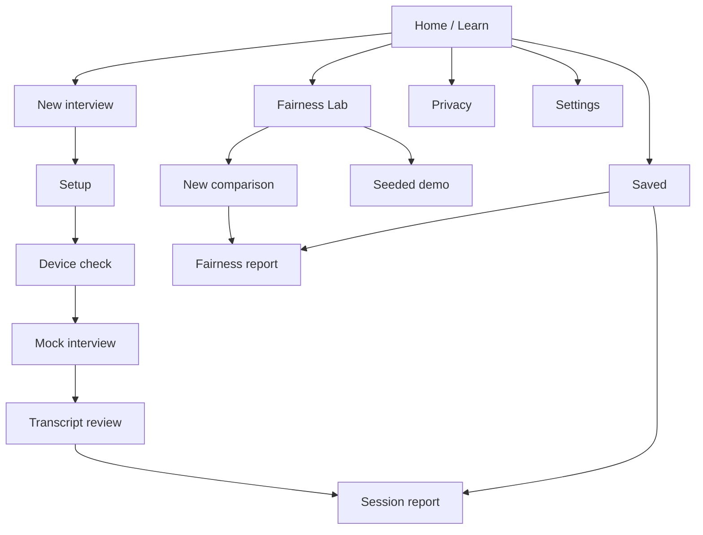
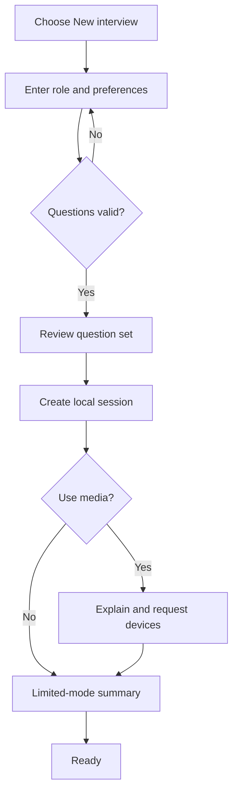
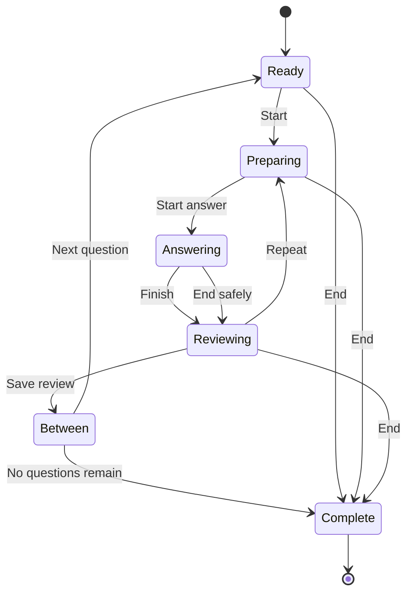
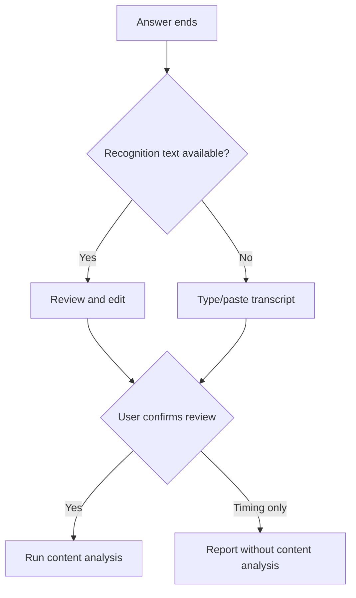
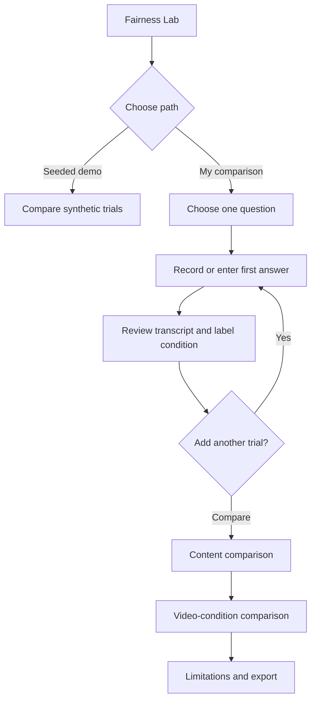

# FairScreen User Experience Specification

**Version:** 1.0  
**Status:** Approved UX direction  
**Audience:** Product, design, frontend, accessibility, and QA

## 1. Experience intent

FairScreen should feel calm, credible, and quietly critical. It should resemble a professional digital-rights product more than an AI demo. The product helps the user prepare, but never creates the feeling that the user is being watched for mistakes.

The interface hierarchy is:

1. **Question and user control**
2. **Answer-content coaching**
3. **Descriptive call conditions**
4. **Technical details and limitations**

Camera imagery is never decorative. No surveillance eye, robot, glowing brain, face wireframe, biometric scan animation, or gamified score appears in marketing or core UI.

## 2. Information architecture

### 2.1 Site map

### 2.2 Route map

| Route | Page | Persistence | Permission behaviour |
| --- | --- | --- | --- |
| `#/` | Home / education | None | Never requests permission. |
| `#/interviews/new` | Interview setup | Draft in React state/session storage only until session creation | Never requests permission. |
| `#/interviews/:sessionId/devices` | Device check | Capability snapshot and chosen settings | Requests camera/microphone only after user action. |
| `#/interviews/:sessionId/practice` | Mock interview | Safe checkpoints and completed response drafts | Uses only already chosen media; never prompts on route load. |
| `#/interviews/:sessionId/responses/:responseId/review` | Transcript/recording review | Saves only after explicit action | No new device request. |
| `#/interviews/:sessionId/report` | Session report | Reads local data | No device request. |
| `#/fairness` | Fairness Lab landing | None until demo/group creation | No device request. |
| `#/fairness/demo` | Seeded demo | Optional demo records | No device request. |
| `#/fairness/new` | Comparison setup | Group draft | Device choice after workflow explanation. |
| `#/fairness/:comparisonId` | Fairness comparison/report | Reads trials/comparison | No automatic request. |
| `#/saved` | Saved sessions | Reads local indexes | No device request. |
| `#/settings` | Settings/data | Reads/writes settings | Capability scan only; no automatic request. |
| `#/privacy` | Privacy/data lifecycle | None | Never requests permission. |
| `#/support/browser` | Browser support details | Transient capability report | Scan only; no automatic request. |
| `*` | Not found | None | No device request. |

Hash routing is the approved MVP choice for static-host portability. The visible route style may be revisited if hosting guarantees rewrite support.

## 3. Global navigation

### Desktop

- Left-aligned wordmark: **FairScreen**
- Primary links: **Practice**, **Fairness Lab**, **Saved**
- Secondary links: **How it works**, **Privacy**, **Settings**
- Right-side privacy badge: **Local-first**

The active route uses text weight, underline/border, and `aria-current="page"`, not colour alone.

### Mobile

- Wordmark and one **Menu** button in the header.
- Menu opens a modal navigation sheet with focus trap, Escape close, and focus return.
- During interview, global navigation is replaced by a compact session header with **End practice**, progress, and privacy status. The user is not trapped; End is always available.

### Footer

- Short statement: “FairScreen is practice software, not an employer assessment.”
- Links: Privacy, Limitations, Accessibility, Source/repository placeholder.
- Version and heuristic version.

## 4. Critical user flows

### 4.1 New interview

Key UX rule: the user sees and may edit the question set before any permission request.

### 4.2 Per-question interview loop

### 4.3 Transcript fallback

### 4.4 Fairness Lab

## 5. Page specifications

## 5.1 Home / Learn

### Purpose

Explain the product in under two minutes and provide immediate paths to practice and the Fairness Lab.

### Desktop layout

1. Dark navy hero.
2. Two-column hero at ≥1024 px:
   - left: headline, short explanation, two calls to action;
   - right: “What FairScreen can and cannot tell you” comparison card.
3. Soft-neutral sections:
   - How practice works.
   - Why camera scoring can mislead.
   - Fairness Lab preview.
   - Privacy summary.
   - Accessibility/limited-mode summary.

### Exact key copy

**Eyebrow:** `Privacy-focused interview practice`

**H1:** `Practice the interview. Question the scoring.`

**Lead:**  
`FairScreen helps you practice automated interviews and improve the substance of your answers. It can describe some video-call conditions, but it does not treat gaze, expression, movement, or speaking style as proof of confidence, honesty, personality, or competence.`

**Primary CTA:** `Start a practice interview`

**Secondary CTA:** `Explore the Fairness Lab`

**Capability card heading:** `What FairScreen measures`

- `Answer timing and reviewed transcript content`
- `Optional microphone-level and pause estimates`
- `Optional camera framing, brightness, face presence, and near-camera orientation`

**Boundary card heading:** `What FairScreen refuses to infer`

- `Emotion or personality`
- `Honesty or deception`
- `Confidence or enthusiasm`
- `Employability or job competence`
- `Identity or demographics`

**Local-first banner:**  
`Your video is not uploaded to FairScreen. Camera analysis runs in your browser, frame-level landmarks are discarded, and recordings are saved only when you choose. Browser speech recognition may use a vendor service; FairScreen asks before using it.`

**Research callout:**  
`A camera can observe pixels. It cannot reliably reveal why a person looked away, paused, moved, or appeared differently on screen.`

### Accessibility notes

- One H1; section H2s in order.
- CTA labels describe destination.
- Comparison card uses two headings/lists, not a red/green good/bad treatment.
- Any preview chart is a static, text-equivalent illustration and receives no misleading score.

## 5.2 How it works / Education

May be an anchored section on Home or a dedicated route; implement dedicated `#/how-it-works` if copy exceeds the landing-page reading target.

### Sections

1. **Interview coaching vs. candidate assessment**
2. **Observable conditions vs. internal traits**
3. **Why “near-camera orientation” is not eye contact**
4. **What optional measurements mean**
5. **How the Fairness Lab works**
6. **Limitations and responsible use**

### Exact key copy

`Looking at the displayed question or interviewer is normal. Because the webcam is usually above or beside the screen, looking at the person on screen may appear as looking away from the camera. FairScreen calls its approximation “near-camera orientation.” It does not measure eye contact or attention.`

`FairScreen is not validated or designed to predict job performance. Do not use it to assess another person.`

## 5.3 Interview setup

### Structure

Use a five-section form with a persistent step summary, not a forced wizard. Users can move among sections before creating the session.

1. Role context
2. Practice format
3. Timing and supports
4. Media and transcription
5. Questions

### Fields

| Field | Control | Rules/help |
| --- | --- | --- |
| Job title | Text, required, max 120 | “Used to adapt local question templates.” |
| Company | Text, optional, max 120 | “Stored only with this local session.” |
| Job description | Textarea, optional, max 20,000 | Character count; paste supported; no upload. |
| Résumé file | File input, optional, PDF/DOCX/TXT up to 5 MiB | Collapsed by default; browser-local extraction; no paste/edit textbox; extracted plain text is previewed read-only and used only after confirmation. |
| Category | Radio/select | General, Software/technical, Customer service, Leadership, Investigative, Custom/mixed. |
| Difficulty | Segmented radios | Foundational, Standard, Advanced. Explain that difficulty changes question complexity, not scoring strictness. |
| Questions | Number/stepper | 1–10; default 5. |
| Preparation time | Select/custom number | 0–600 seconds. |
| Answer time | Select/custom number | 30–1200 seconds. |
| Timing mode | Radio cards | Flexible (recommended), Strict practice, Untimed. |
| Live coaching | Checkbox | Off by default. |
| Transcription | Radio cards | Ask when supported, Manual transcript, Timing only. |
| Recording | Checkbox | Off by default; “Enabling capture does not save recordings automatically.” |
| Camera | Checkbox | Optional. |
| Microphone | Checkbox | Optional. |

### M07.2 upload-only resume file import

Remove manual resume typing and pasting from setup. The only resume input method
is **Choose resume file** for PDF, DOCX, and TXT files up to 5 MiB. Copy must
state that the document is processed locally in the browser and is not uploaded.
The extracted text is plain text only; document-provided HTML is never rendered.

After successful extraction, show a clear success state, file format, extracted
character count, a collapsed read-only plain-text preview, **Use this resume**,
**Choose another file**, and **Remove resume**. The internal `resumeText` domain
field is updated only after the user confirms **Use this resume**. If a resume
is already confirmed, ask before replacing it. If generated questions already
exist, confirming, replacing, or removing a resume clears the stale question set
and tells the user to generate again. Importing never creates a session, starts
device checks, or generates questions automatically.

Import states:

- Loading: `Extracting resume text locally.`
- Extraction success: `Resume text was extracted locally. Review the preview before using it.`
- Confirmed: `Resume selected for question generation.`
- Canceled replacement: `Replacement canceled. The selected resume was kept.`
- Removed: `Resume removed. Choose a file to add one.`
- Error states identify empty documents, unsupported formats, legacy DOC,
  oversized files, parsing failure, password-protected PDF, image-only PDF with
  no OCR, and text over 20,000 characters. Error guidance must instruct the user
  to upload another valid text-based PDF, DOCX, or TXT file, not paste text.

Status changes use a sparse live region. Failed imports move focus to the
actionable error message. The file input resets after processing so the same
file can be selected again. The control must remain keyboard-operable at 320 CSS
px, in forced colours, with reduced motion, and with screen-reader labels.

### Timing copy

**Flexible:** `Shows the target time and lets you continue.`

**Strict practice:** `Ends the answer when time expires. You can extend the time, and you may switch modes before starting.`

**Untimed:** `No countdown or automatic transition.`

### Question review

After **Generate question set**, render ordered editable cards:

- drag handle plus Move up/down buttons;
- question text;
- source label (`Built-in`, `Adapted with role term`, `Custom`);
- difficulty;
- Replace, Edit, Remove;
- Add custom question.

Do not show an “AI-generated” badge. The provider is template-based.

### Validation

- On submit, focus an error summary.
- Inline errors remain adjacent.
- Keep all valid input.
- If job/résumé text exceeds limits, do not silently truncate; identify exact limit.

### Primary actions

- `Generate question set`
- `Review devices and start`
- Alternative: `Start without camera or microphone`

## 5.4 Device check

### Entry notice

**H1:** `Check your setup`

`Camera and microphone access are optional. FairScreen asks only for the devices you selected. You can continue without either one.`

### Permission cards

Each device card has four states:

1. Not requested
2. Requesting
3. Available
4. Denied/unavailable

**Camera request:**  
`Use the camera for a local preview and optional video-call condition measurements. Video is not uploaded to FairScreen.`

Buttons: `Allow camera`, `Continue without camera`

**Microphone request:**  
`Use the microphone for a level check, timing estimates, and optional recording or transcription.`

Buttons: `Allow microphone`, `Continue without microphone`

The word **Allow** describes the user action but does not imply the browser will grant it.

### Preview region

- `<video>` with explicit accessible label and decorative status overlay outside the video.
- `Hide my preview` toggle; analysis may continue only if user chose it, with explanatory text.
- `Mirror preview` affects display only.
- Camera selector.
- Text conditions:
  - `Face shape detected`
  - `No face shape detected in the latest samples`
  - `Position appears within the broad centre guide`
  - `Position appears outside the broad centre guide`
  - `Lighting appears dim / balanced / bright / uneven`
  - `Video analysis is not available`

Never use “Pass/Fail.”

### Microphone region

- Meter plus text: `No level yet`, `Low signal`, `Signal detected`, `Possible clipping`.
- Selector and `Test microphone`.
- Never say `quiet speaker`, `confident volume`, or `good voice`.

### Browser support summary

Table rows: Preview, audio timing, local video conditions, recording, browser transcription, local sessions.

Statuses: `Available`, `Limited`, `Unavailable`, `Permission needed`.

### Limited-mode confirmation

**Heading:** `Your practice mode`

Example:

`You can complete the full question and transcript workflow. Camera conditions and audio timing will not be available. You can type or paste each answer for content coaching.`

Actions: `Begin practice`, `Change setup`

## 5.5 Mock interview

### Emotional tone

The page avoids dense dashboards. The current question and primary action dominate. Optional meters are secondary and can be hidden.

### Desktop layout ≥1024 px

- Session header: progress, state label, media indicators, `End practice`.
- Main grid 7/5 columns:
  - question/timer/controls;
  - camera preview or privacy-safe placeholder.
- Optional coaching drawer below/aside.

### Tablet

- Question above preview.
- Controls sticky at bottom but never obscure focus.
- Metrics collapsed into `Setup observations`.

### Mobile

- Question first.
- Camera preview as 16:9 card below question, hideable.
- Primary controls in document order, not a fixed overlay that covers keyboard.
- Progress text rather than a wide stepper.

### State-specific copy and controls

#### Ready

**State label:** `Ready`

**Heading:** `Question {current} of {total}`

Buttons: `Start preparation`, `Skip question`, `End practice`

#### Preparing

**State label:** `Preparation`

Timer visible if used. Buttons: `Start answer now`, `Add time`, `Skip`, `End`

No microphone capture, recording, or transcription until Answering.

#### Answering

**State label:** `Answering`

Persistent indicator examples:

- `Microphone active`
- `Camera active`
- `Recording in memory`
- `Browser transcription active`

Primary button: `Finish answer`

Secondary: `Add time`, `Hide my preview`, `Stop media`, `End practice`

Flexible expiry copy:

`Target time reached. Finish when you are ready.`

Strict warning:

`20 seconds remaining. Add time if you need it.`

#### Reviewing

**State label:** `Review this answer`

Tabs or stacked sections:

1. Transcript
2. Recording (only when captured)
3. What was measured

Actions:

- `Save and continue`
- `Repeat this question`
- `Use timing-only feedback`
- `End practice`

If a recording exists in memory:

- unchecked option/button: `Save recording on this device`
- `Discard recording`
- clear size estimate and shared-device warning.

#### Between questions

Short rest state:

`Answer saved locally. The next question is ready when you are.`

Buttons: `Next question`, `View answer`, `End practice`

#### Complete

`Practice complete`

Buttons: `View report`, `Retry a question`, `Start another interview`

### Screen-reader announcements

- State entry and question progress.
- Timer at configured sparse thresholds, never every second.
- Media lost/stopped.
- Answer saved.
- No announcement for each face/mic sample.
- Visual condition prompts use a separate user-toggleable polite region and debounce ≥5 seconds.

### Keyboard model

All controls use standard Tab order and native buttons. Optional shortcuts:

- `Ctrl/Command + Enter`: activate current primary action.
- `Escape`: open End confirmation only when not in a text editor.

Do not use single-letter shortcuts. Shortcut help is available and shortcuts can be disabled.

## 5.6 Transcript review

### Layout

1. Question snapshot.
2. Source status:
   - `Browser transcript — review required`
   - `Manual transcript`
   - `No transcript — timing-only feedback`
3. Large textarea.
4. Recognition limitations notice.
5. Confirmation.

### Exact copy

`Automatic transcripts can omit or change words, especially with noise, accents, names, technical terms, or speech differences. Edit this text so it reflects what you intended to say. FairScreen analyzes the reviewed text, not the recording.`

Checkbox:

`I reviewed this transcript and want FairScreen to analyze this version.`

Alternative button:

`Continue without content analysis`

The checkbox must not be preselected.

## 5.7 Session report

### Order

1. Session identity and context.
2. Prominent warning.
3. Overall coaching summary based only on per-question content findings.
4. Per-question accordion/cards.
5. Separate practice-timing summary.
6. Separate video-call conditions.
7. Notes.
8. Retry/export/delete.

### Required warning

> Camera position, gaze direction, lighting, facial movement, disability, culture, anxiety, and hardware setup are not reliable measures of job competence. Visual measurements are provided only to help users understand video-call conditions.

### Summary behaviour

No score, dial, rank, stars, percentile, grade, or “overall performance.”

Allowed summary example:

`Across 3 reviewed answers, FairScreen frequently detected a clear description of your own actions. Specific outcomes were detected in 1 answer. Consider making the result explicit in the other examples. This is transcript-based coaching, not an assessment of suitability.`

### Per-question content card

- Question and attempt selector.
- Reviewed transcript.
- Category rows:
  - label;
  - rating chip;
  - cautious explanation;
  - expandable “Why this appeared” evidence.
- Detected strengths.
- Suggested next revision.
- `Retry this question`.

Rating display:

- Strong
- Developing
- Needs more evidence
- Not available
- Not applicable

Do not use red for “Needs more evidence.” Use neutral amber/brown plus icon/text.

### Timing and audio card

Use plain rows with definitions:

- Answer duration
- Delay before detected speech
- Approximate speaking time
- Approximate silence time
- Longest internal silence
- Approximate microphone level
- Approximate words per minute

Inline limitation:

`These estimates depend on your microphone, room, browser, and transcript. They are not measures of confidence, fluency, or competence.`

### Video conditions card

Default collapsed after content. Rows:

- Face shape detected
- Broad centring condition
- Near-camera orientation
- Framing
- Brightness
- More than one face-like region

No “ideal score.” Provide `What this means` and `Why it may be inaccurate`.

### Export dialog

Title: `Export local report`

Checkable fields:

- Session context
- Reviewed transcripts
- Coaching feedback
- Timing/audio metrics
- Video conditions
- Notes

Never include recording. Show:

`Exports may contain personal or confidential information. Review the included fields before saving or sharing the file.`

Formats: `Print`, `Plain text`, `JSON`

## 5.8 Fairness Lab landing

### Position

This is a primary navigation destination and must visually receive equal weight to Practice.

### Exact copy

**H1:** `Fairness Lab`

`Compare materially similar answers under different video conditions. FairScreen keeps answer content and camera conditions separate so a change in lighting, framing, or orientation is not presented as a change in competence.`

Primary CTA: `Try the camera-free demonstration`

Secondary CTA: `Create my own comparison`

### “What this can show”

`A comparison can show that observable video conditions changed while reviewed answer content stayed similar.`

### “What this cannot prove”

`A small self-comparison cannot establish that a specific hiring system is biased, reveal how a third-party model scores candidates, or prove a causal effect.`

## 5.9 Seeded Fairness demonstration

### Demo dataset

Clearly label: `Synthetic demonstration — no camera was used`

Question:

`Tell me about a time you solved a difficult problem. What did you personally do?`

Use the same reviewed transcript in four trials:

1. Near-camera setup
2. Looking at displayed question
3. Side-positioned camera
4. Dim lighting

The transcript should describe a realistic but fictional, non-user achievement. Never seed the user's real résumé data.

### Layout

1. Invariance banner.
2. Answer Content table.
3. Accessible “content stayed stable” visualization.
4. Video Conditions table.
5. Accessible “conditions varied” small-multiple bars.
6. Explanation and limitations.

### Exact invariance message

> The answer content remained unchanged. Differences in video conditions should not be interpreted as differences in competence.

### Visualization design

The table is canonical. The chart duplicates:

- four equal-height content markers labeled `Same reviewed transcript`;
- separate horizontal bars for face presence, centring, and near-camera orientation;
- categorical brightness/framing labels.

Do not connect the content and condition marks with arrows that imply causality. Do not use a radar chart or overall video score.

## 5.10 Create/manage Fairness comparison

### Setup

- Choose a built-in/custom question.
- Explain “materially similar.”
- Choose entry mode for each trial:
  - answer live;
  - type/paste transcript with manually described conditions;
  - reuse a reviewed response.
- Choose/enter condition label and notes.

### Similarity results

| Band | UI label | Copy |
| --- | --- | --- |
| Exact | `Same reviewed transcript` | `Normalized transcript text is identical.` |
| Substantially unchanged | `Content substantially unchanged` | `Word choice varies slightly, while the deterministic similarity checks remain above the approved threshold.` |
| Similar | `Related but changed` | `The answers cover similar material but changed enough that condition-only comparison should be treated cautiously.` |
| Different | `Different answer content` | `The answers differ too much for FairScreen to present content as held constant.` |
| Unavailable | `Similarity not available` | State missing transcript/review reason. |

Only Exact and Substantially unchanged trigger the required invariance banner.

### Trial management

- Never select a “winner.”
- Preserve attempts.
- Allow delete/edit label.
- If transcript edited after comparison, mark comparison stale and require recomputation.

## 5.11 Saved sessions

### Layout

- H1 and `New interview`.
- Search.
- Filter button/region.
- Sort.
- Tabs/filters: All, Complete, Incomplete, Fairness comparisons, Demo.
- Cards/table toggle; table preferred desktop, cards mobile.

### Session row/card

- Job title, company if present.
- Date/time.
- Status and question progress.
- Category/media mode.
- `Resume`, `View report`, overflow menu.

### Empty states

**No saved data:**  
`No practice sessions are stored in this browser yet.`

Buttons: `Start a practice interview`, `Explore the Fairness Lab`

**No filter results:**  
`No saved items match these filters.`  
Button: `Clear filters`

**Storage unavailable:**  
`This browser could not open local session storage. You can still practice in an ephemeral session and export before closing the page.`

## 5.12 Settings and data

### Sections

1. Practice defaults
2. Accessibility
3. Privacy and optional features
4. Browser capability
5. Local data
6. Reset

### Local data panel

- `Approximate storage used: {usage}` or `Estimate not available`
- Counts for sessions, responses, saved recordings, comparisons, demo records.
- Explanation:

`FairScreen uses this browser's local storage. Browser storage is best effort: it can be cleared by you or the browser, and private-browsing data is usually removed when the private session ends. Export anything you need to keep.`

Actions:

- `Review saved items`
- `Remove demo data`
- `Delete all FairScreen data`

### Delete-all dialog

Title: `Delete all FairScreen data from this browser?`

Body:

`This permanently removes sessions, transcripts, metrics, notes, saved recordings, comparisons, demo data, and settings stored by this site. Export anything you need first.`

Confirmation field: `Type DELETE`

Buttons: `Delete all data`, `Cancel`

## 5.13 Privacy page

Must use the data-lifecycle table from the privacy specification in plain language.

### Headline

`Your practice data stays under your control`

### Required disclosures

- What runs locally.
- What is never stored.
- What is stored and when.
- Speech-recognition vendor caveat.
- Same-origin assets.
- Browser storage limitations.
- Shared-device risk.
- Export/deletion.
- No analytics/tracking in MVP.
- No claim of encryption-at-rest.

## 5.14 Browser support page

Use capability tiers:

- **Available:** directly detected and initialized.
- **Limited:** API exists but format/provider/locality/reliability varies.
- **Unavailable:** feature absent or failed; fallback shown.
- **Blocked:** context/policy/permission prevents use.
- **Unknown:** not tested until user action.

Never present one overall “browser score.”

## 5.15 Not found and route error

**Not found H1:** `That FairScreen page was not found`

Actions: `Go home`, `Open saved sessions`

Route error:

`FairScreen stopped active camera and microphone access while recovering from an unexpected error. Your last confirmed local save is unchanged.`

Show stable diagnostic code and `Copy technical details` only when details contain no user content.

## 6. Component inventory

### 6.1 Foundation

| Component | Required states |
| --- | --- |
| `AppShell` | default, interview focus mode, print |
| `PageHeader` | title, lead, actions, breadcrumbs optional |
| `Section` | light, subtle, dark emphasis |
| `Card` | default, interactive, selected, disabled, warning, error |
| `Button` | primary, secondary, quiet, danger; hover/focus/active/disabled/loading |
| `IconButton` | accessible name, tooltip optional, same states |
| `Link` | default, visited where useful, focus |
| `Badge` | neutral, info, available, limited, unavailable; always text |
| `Callout` | information, limitation, privacy, warning, error |
| `Dialog` | confirmation, destructive, informational |
| `Disclosure` | open/closed; native `
` preferred where suitable |
| `Tabs` | use only where panels are peer views and remain accessible |
| `Toast/StatusMessage` | polite success/info; assertive error; persistent alternative |
| `Skeleton` | reduced-motion safe; never for critical error |
| `EmptyState` | first use, no results, unavailable |

### 6.2 Forms

`Field`, `Fieldset`, `TextInput`, `Textarea`, `Select`, `RadioCards`, `Checkbox`, `NumberStepper`, `SegmentedControl` only if implemented as radios, `ErrorSummary`, `CharacterCount`, `FormActions`.

### 6.3 Interview

`QuestionCard`, `InterviewProgress`, `StateLabel`, `AccessibleTimer`, `MediaStatusBar`, `CameraPreview`, `MicrophoneMeter`, `LivePrompt`, `InterviewControls`, `TranscriptEditor`, `RecordingReview`, `AttemptSelector`.

### 6.4 Analysis/report

`AnalysisCategoryRow`, `EvidenceList`, `MetricDefinitionRow`, `LimitationNote`, `ContentSummary`, `ConditionSummary`, `ExportDialog`, `PrintHeader`.

### 6.5 Fairness Lab

`TrialCard`, `ConditionLabelPicker`, `SimilaritySummary`, `ContentComparisonTable`, `ConditionComparisonTable`, `InvarianceBanner`, `AccessibleBarList`, `FairnessLimitations`.

### 6.6 Data/settings

`SessionTable`, `SessionCard`, `FilterPanel`, `StorageUsage`, `CapabilityTable`, `DeleteDataDialog`.

## 7. Visual design system

### 7.1 Colour roles

Tokens are semantic. Final implementation must run automated contrast checks.

| Token | Value | Use |
| --- | --- | --- |
| `navy-950` | `#07111F` | Hero/footer/deep emphasis |
| `navy-900` | `#0D1B2A` | Dark surfaces |
| `navy-800` | `#17304A` | Dark border/secondary |
| `surface-page` | `#F5F7FA` | Page background |
| `surface-card` | `#FFFFFF` | Cards/forms |
| `surface-subtle` | `#EDF2F6` | Grouping, table header |
| `text-strong` | `#172033` | Main text |
| `text-muted` | `#526176` | Secondary text |
| `border` | `#CBD5E1` | Dividers/controls |
| `teal-700` | `#0F766E` | Primary action on light surface |
| `teal-600` | `#0D9488` | Accent/decorative only unless contrast verified |
| `blue-700` | `#1D4ED8` | Links/information |
| `focus` | `#0B66FF` | 3 px focus ring with offset |
| `positive` | `#067647` | Available/confirmed with text/icon |
| `caution` | `#8A4B08` | Limited/needs evidence with text/icon |
| `danger` | `#B42318` | Destructive/error only |
| `info-bg` | `#EAF2FF` | Information callout |
| `privacy-bg` | `#E8F7F4` | Privacy callout |
| `caution-bg` | `#FFF4E5` | Limitation/caution |
| `danger-bg` | `#FDECEC` | Error/destructive confirmation |

Do not encode “Strong” as bright green or “Needs more evidence” as alarm red. Ratings are coaching states, not grades.

### 7.2 Typography

- Preferred: self-hosted `Inter Variable`; fallback `ui-sans-serif, system-ui, -apple-system, BlinkMacSystemFont, "Segoe UI", sans-serif`.
- No remote font request.
- Body base: 16 px / 1.55.
- Small: 14 px / 1.45; never use <14 px for essential text.
- H1: clamp 36–56 px / 1.05 desktop; 34–40 mobile.
- H2: 28–36 px / 1.15.
- H3: 21–24 px / 1.25.
- Labels/buttons: 15–16 px, 600 weight.
- Numeric timers: tabular numerals; 40–64 px depending viewport.
- Limit line length to about 70–75 characters for prose.

### 7.3 Spacing

4 px base:

`1=4`, `2=8`, `3=12`, `4=16`, `5=20`, `6=24`, `8=32`, `10=40`, `12=48`, `16=64`, `20=80`.

Page gutters:

- mobile 16 px;
- tablet 24 px;
- desktop 32–48 px;
- max content width 1200 px;
- reading column max 760 px.

### 7.4 Shape and depth

- Control radius 8 px.
- Card radius 14 px.
- Large emphasis panel radius 20 px.
- Border 1 px.
- Shadow: restrained `0 8px 24px rgba(7,17,31,.08)` only for raised dialogs/cards.
- Dark areas rely on colour/border, not glow.

### 7.5 Motion

- Default transitions 120–180 ms for opacity/colour/short transform.
- No pulsing face outline, scanning animation, confetti, score count-up, or shaking error.
- Timers update text without animating layout.
- Reduced-motion removes non-essential transforms and animated meters; text status remains.

## 8. Responsive behaviour

| Viewport | Behaviour |
| --- | --- |
| `<640 px` | Single column; full-width primary actions; tables become horizontally scrollable regions or labeled cards; preview below question; no sticky layer over virtual keyboard. |
| `640–767 px` | Single column with wider cards; two-up compact fields only when labels remain readable. |
| `768–1023 px` | Two-column forms where useful; interview remains question-first stacked; filter panel may be side sheet. |
| `≥1024 px` | Full navigation; interview 7/5 grid; saved data table; report content column plus sticky actions/outline. |
| `≥1280 px` | More whitespace, not denser dashboards; max widths retained. |

Content order must remain logical without CSS. Preview may move visually but follows question and core controls in DOM order unless testing demonstrates a better screen-reader sequence.

## 9. State patterns

### Loading

- Use descriptive text: `Preparing local video analysis…`
- Provide Cancel/continue-without for model load >3 seconds.
- No indefinite spinner without status.

### Permission waiting

- `Waiting for your browser's permission choice…`
- Button: `Continue without this device`
- Do not automatically re-request.

### Empty

Explain whether it is first use, filters, missing transcript, or unavailable capability.

### Partial

`Some measurements are partial because the microphone became unavailable after 42 seconds. Your answer and reviewed transcript are still available.`

### Error

Use a stable title, plain explanation, data impact, and next actions:

1. What happened.
2. What remains safe/saved.
3. What the user can do.

### Stale

When transcript or trial changes:

`This analysis is based on an earlier transcript version.`  
Button: `Analyze reviewed version`

## 10. Print specification

- White background, black/dark text.
- Hide navigation, setup controls, video, audio player, buttons, filters, and live states.
- Show title, generated date, local-only note, session metadata selected for export, content findings, separate conditions, notes if selected, limitations, algorithm/schema versions.
- Expand accordions.
- Repeat table headers across pages.
- Avoid row/card breaks where possible.
- Display link destinations in a references section only when useful.
- Required warning appears on the first report page and before video-condition tables.
- Fairness report includes comparison band rules and the non-causality limitation.

## 11. UX acceptance checklist

- [ ] Home communicates purpose, boundary, privacy, and two core actions.
- [ ] No route requests media on load.
- [ ] Question set can be reviewed before permissions.
- [ ] Camera/microphone can each be declined without a dead end.
- [ ] Interview has one obvious primary action per state.
- [ ] End/stop-media controls remain available.
- [ ] Strict timing is opt-in; untimed and extension paths exist.
- [ ] Screen-reader timer is not announced every second.
- [ ] Transcript must be reviewed before content analysis.
- [ ] Content appears before and separately from video conditions.
- [ ] No overall score, ranking, grade, or trait label appears.
- [ ] Seeded Fairness demo needs no permission.
- [ ] Tables provide every chart value.
- [ ] Similarity uncertainty and comparison limitations are visible.
- [ ] Recording requires enable-then-save choices.
- [ ] Shared-device and export sensitivity warnings are clear.
- [ ] Delete scopes are explicit.
- [ ] All empty/loading/permission/error/partial/stale states have designed copy.
- [ ] Mobile at 320 px and 200% zoom retains all functions.
- [ ] Print is legible and complete.
