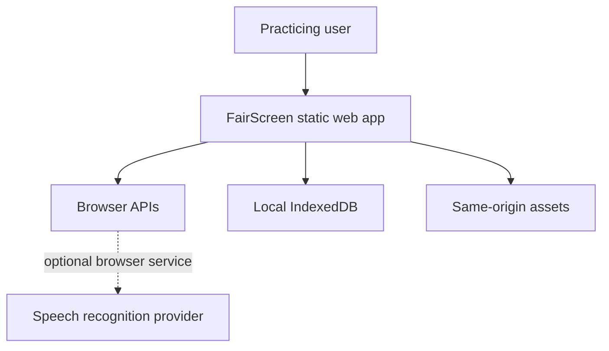
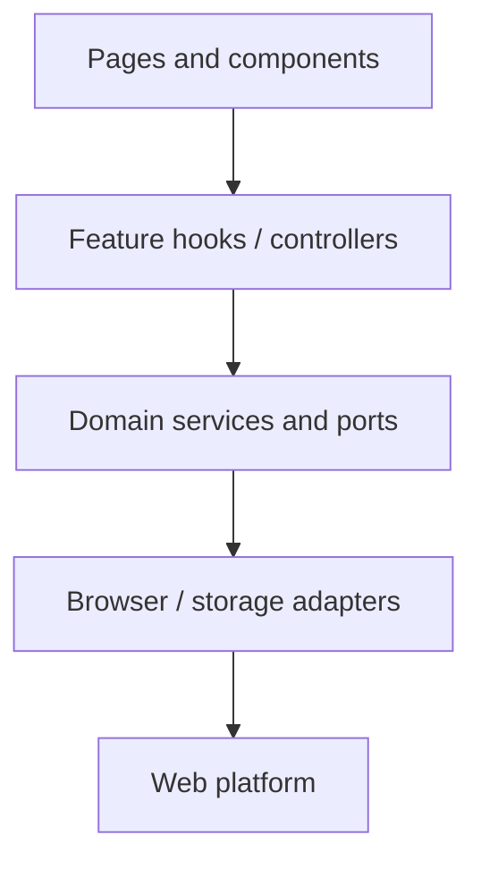
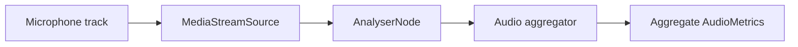
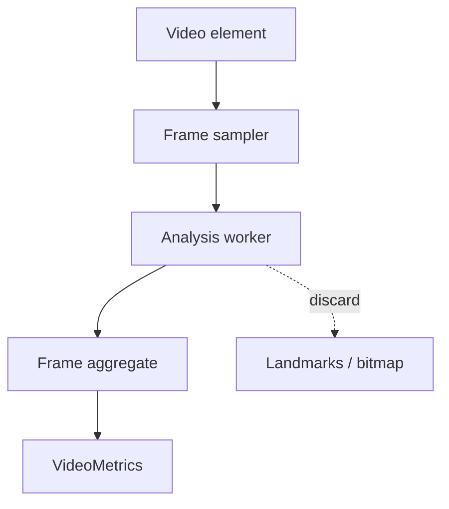
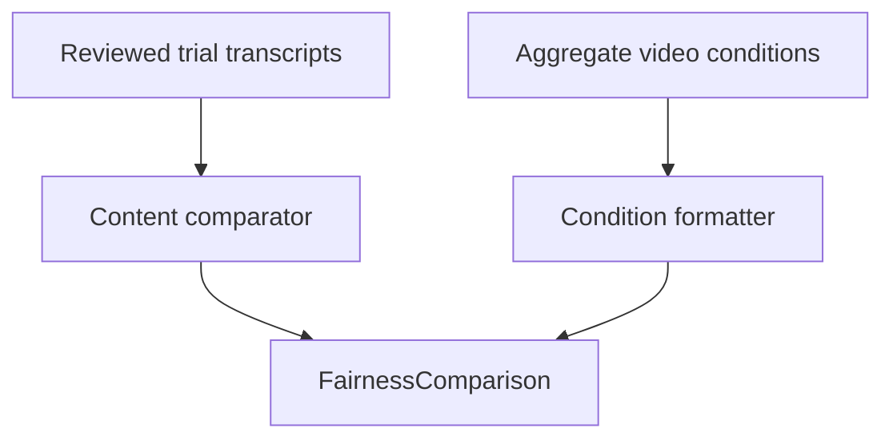

# FairScreen Technical Architecture

**Version:** 1.0  
**Status:** Approved architecture for the MVP  
**Related normative models:** [05_FairScreen_Domain_Models.md](./05_FairScreen_Domain_Models.md)  
**Related metric algorithms:** [06_FairScreen_Measurement_Specification.md](./06_FairScreen_Measurement_Specification.md)

## 1. Architecture goals

The architecture must make the product's ethical boundaries difficult to violate accidentally.

1. Answer-content analysis cannot receive video metrics.
2. Raw frames, audio buffers, and face landmarks cannot enter persistence models.
3. Browser APIs sit behind typed ports and are replaceable with test fakes.
4. Optional capabilities fail independently.
5. The interview state machine owns capture start/stop order.
6. Recording persistence requires a second explicit user command.
7. A future server-backed provider can implement an existing interface, but no secret or provider SDK is added to the client.
8. Static pages and camera-free practice do not load MediaPipe or request media.

## 2. Approved stack

### Runtime

- React
- TypeScript in strict mode
- Vite
- Tailwind CSS
- React Router using a hash router for host-independent static routes
- Lucide React
- Zod for runtime validation at persistence, export/import, worker-message, and external-configuration boundaries
- MediaPipe `@mediapipe/tasks-vision` Face Landmarker
- Browser MediaDevices, MediaRecorder, Web Audio, Web Speech where supported, Worker, WebAssembly, IndexedDB, Storage, Blob, and print APIs

### Development and quality

- Vitest
- React Testing Library
- `@testing-library/user-event`
- ESLint with TypeScript, React Hooks, import-boundary, and accessibility rules
- Prettier
- Playwright for real-browser permission, storage, media-fake, and cross-browser flows
- `axe-core` integration for automated accessibility checks

Playwright and axe are approved additions because jsdom cannot validate real media permission behaviour, codecs, IndexedDB lifecycle, focus in multiple browser engines, or the production route bundle.

### Version policy

- At milestone start, use mutually compatible current stable majors.
- Commit exact versions in the lockfile.
- Do not use `latest` in production asset URLs.
- Document Node and package-manager versions in `.nvmrc` or equivalent and `packageManager`.
- Renovation/automatic dependency upgrades are deferred; dependency changes require tests and a decision note when browser behaviour changes.

## 3. System context



Boundaries:

- FairScreen has no application server in the MVP.
- Same-origin assets include JS, CSS, fonts, MediaPipe WASM, and the model asset.
- Browser speech recognition may be local or remote depending on the browser. It is outside FairScreen's control and remains off until separately disclosed and chosen.
- No data is sent to a FairScreen-controlled network endpoint.

## 4. Architectural style

Use a feature-oriented React application with a small domain/core layer and explicit infrastructure adapters.



Dependency direction is downward only:

- `app` may depend on `features`, `shared`, and `domain`.
- `features` may depend on `domain` and `shared`.
- `domain` has no React, DOM, MediaPipe, IndexedDB, or browser dependencies.
- `infrastructure` implements `domain` ports and may depend on browser/vendor APIs.
- `shared/ui` has no feature-specific business logic.
- Pages never call `navigator.mediaDevices`, `indexedDB`, `MediaRecorder`, `SpeechRecognition`, or MediaPipe directly.

## 5. Proposed folder structure

```text
fairscreen/
├─ public/
│  └─ mediapipe/
│     ├─ models/
│     │  └─ face_landmarker.task
│     ├─ wasm/
│     └─ NOTICE.md
├─ src/
│  ├─ app/
│  │  ├─ App.tsx
│  │  ├─ router.tsx
│  │  ├─ providers.tsx
│  │  ├─ error-boundaries/
│  │  └─ styles/
│  │     ├─ tokens.css
│  │     ├─ globals.css
│  │     └─ print.css
│  ├─ domain/
│  │  ├─ models/
│  │  ├─ ports/
│  │  │  ├─ AnswerAnalyzer.ts
│  │  │  ├─ CapabilityPort.ts
│  │  │  ├─ Clock.ts
│  │  │  ├─ IdGenerator.ts
│  │  │  ├─ QuestionProvider.ts
│  │  │  ├─ SessionRepository.ts
│  │  │  └─ TranscriptionProvider.ts
│  │  ├─ interview/
│  │  │  ├─ interviewMachine.ts
│  │  │  ├─ interviewEvents.ts
│  │  │  └─ interviewInvariants.ts
│  │  ├─ analysis/
│  │  ├─ fairness/
│  │  └─ errors/
│  ├─ features/
│  │  ├─ education/
│  │  ├─ interview-setup/
│  │  ├─ device-check/
│  │  ├─ interview/
│  │  ├─ transcript-review/
│  │  ├─ reports/
│  │  ├─ fairness-lab/
│  │  ├─ saved-sessions/
│  │  └─ settings/
│  ├─ infrastructure/
│  │  ├─ capabilities/
│  │  ├─ media/
│  │  │  ├─ MediaDeviceService.ts
│  │  │  ├─ MediaRecorderAdapter.ts
│  │  │  ├─ ResourceRegistry.ts
│  │  │  └─ mediaErrors.ts
│  │  ├─ audio/
│  │  │  ├─ WebAudioAnalyzer.ts
│  │  │  ├─ voiceActivity.ts
│  │  │  └─ audioMath.ts
│  │  ├─ video/
│  │  │  ├─ VideoAnalysisClient.ts
│  │  │  ├─ videoAnalysis.worker.ts
│  │  │  ├─ videoWorkerProtocol.ts
│  │  │  ├─ orientation.ts
│  │  │  ├─ brightness.ts
│  │  │  └─ framing.ts
│  │  ├─ transcription/
│  │  │  ├─ BrowserSpeechProvider.ts
│  │  │  ├─ ManualTranscriptProvider.ts
│  │  │  └─ TranscriptionCoordinator.ts
│  │  ├─ questions/
│  │  │  ├─ LocalTemplateQuestionProvider.ts
│  │  │  ├─ keywordExtractor.ts
│  │  │  └─ seededRandom.ts
│  │  ├─ analysis/
│  │  │  ├─ DeterministicAnswerAnalyzer.ts
│  │  │  ├─ heuristics/
│  │  │  └─ language/
│  │  ├─ persistence/
│  │  │  ├─ FairScreenDatabase.ts
│  │  │  ├─ IndexedDbSessionRepository.ts
│  │  │  ├─ migrations/
│  │  │  ├─ repositoryGuards.ts
│  │  │  └─ demoSeed.ts
│  │  └─ export/
│  │     ├─ JsonExporter.ts
│  │     ├─ TextExporter.ts
│  │     └─ PrintPresenter.ts
│  ├─ data/
│  │  └─ questions/
│  │     ├─ general.ts
│  │     ├─ technical.ts
│  │     ├─ customerService.ts
│  │     ├─ leadership.ts
│  │     └─ investigative.ts
│  ├─ shared/
│  │  ├─ ui/
│  │  ├─ hooks/
│  │  ├─ validation/
│  │  ├─ formatting/
│  │  └─ constants/
│  ├─ test/
│  │  ├─ factories/
│  │  ├─ fixtures/
│  │  ├─ fakes/
│  │  └─ setup.ts
│  ├─ main.tsx
│  └─ vite-env.d.ts
├─ e2e/
│  ├─ fixtures/
│  ├─ permissions.spec.ts
│  ├─ camera-free.spec.ts
│  ├─ fairness-demo.spec.ts
│  ├─ storage.spec.ts
│  └─ accessibility.spec.ts
├─ scripts/
│  ├─ verify-prohibited-language.mjs
│  ├─ verify-question-bank.mjs
│  └─ verify-bundle-boundaries.mjs
├─ docs/
│  ├─ architecture.md
│  ├─ privacy.md
│  └─ algorithm-versions.md
├─ .env.example                         # public, non-secret values only
├─ eslint.config.js
├─ playwright.config.ts
├─ tailwind.config.ts                   # if required by selected Tailwind major
├─ tsconfig.json
├─ vite.config.ts
└─ vitest.config.ts
```

## 6. React state strategy

### 6.1 State categories

| State | Owner | Persistence |
| --- | --- | --- |
| Current route | React Router | URL |
| Setup draft before session creation | `InterviewSetupProvider` with reducer | `sessionStorage` optional, sanitized; cleared after create |
| Active interview state | `useInterviewController` + pure `interviewMachine` reducer | Safe checkpoints only |
| Active media handles | Infrastructure `ResourceRegistry`, refs | Never serialized |
| Transient frame/audio samples | Worker/analyzer internals | Never in React state |
| Current response draft | Interview feature reducer | Persist at safe review checkpoints; recording remains memory until save |
| Sessions/responses/settings | Repository queried via hooks | IndexedDB |
| Toast/status UI | App-level status provider | Memory |
| Capability report | Capability hook/context | Memory; optional snapshot in session |

### 6.2 No general global state library

React context plus feature reducers are sufficient for the MVP. Do not add Redux, Zustand, or XState unless a recorded decision shows the interview machine or repository synchronization cannot remain clear and testable.

The interview state machine is a pure reducer:

```ts
type InterviewTransition = (
  state: InterviewMachineState,
  event: InterviewEvent,
) => TransitionResult;
```

Side effects occur after a valid transition through an effect coordinator. The reducer never starts media, writes IndexedDB, reads time, creates IDs, or navigates.

### 6.3 Side-effect ordering

For `START_ANSWER`:

1. Validate transition and commit `answering`.
2. Create a response draft ID and monotonic start timestamp.
3. Start enabled audio/video aggregators.
4. Start MediaRecorder if capture was enabled.
5. Start browser speech provider if selected and disclosed.
6. If one optional service fails, record its partial/unavailable state and continue.

For `FINISH`:

1. Mark stop timestamp once.
2. Stop recognition.
3. Stop recorder and await bounded final Blob event.
4. Stop audio/video sampling and finalize aggregates.
5. Create review draft.
6. Transition to `reviewing`.
7. Keep Blob in memory behind a transient handle; do not write it.

The coordinator uses `Promise.allSettled` for independent optional finalizers, but state mutation and repository transactions are ordered.

## 7. Browser capability architecture

### 7.1 Capability tiers

```ts
type CapabilityStatus =
  | "supported"
  | "limited"
  | "unsupported"
  | "blocked"
  | "unknown";
```

Capabilities are not collapsed into a score.

| Capability | Detection | Classification | Fallback |
| --- | --- | --- | --- |
| Secure context | `window.isSecureContext` | Required for deployed media; localhost accepted for development | Camera/mic unavailable; manual mode |
| `getUserMedia` | Function presence, then user-initiated request | Confirmed API; permission/device result separate | No-media mode |
| Device enumeration | Function presence, result after permission | Confirmed, permission-gated labels/devices | Browser default |
| Web Audio | `AudioContext`/`webkitAudioContext`, actual start | Confirmed; can be suspended | Timing-only |
| MediaRecorder | Constructor presence plus MIME probes and trial | API confirmed; format/runtime browser-dependent | No recording |
| Worker/WebAssembly | Presence and MediaPipe worker handshake | Required for video-condition analysis | Preview only |
| Face Landmarker | Lazy asset load/init test | Vendor preview; optional | Video metrics unavailable |
| Speech recognition | Constructor/prefix plus provider start | Limited; locality may be remote/unknown | Manual transcript |
| IndexedDB | Open/migration/write/read/delete probe in temporary store | Confirmed but fallible/quota-dependent | Ephemeral session/export |
| Storage estimate/persist | Method presence and result | Optional estimates/persistence request | Explain estimate unavailable |
| Print/Blob download | Feature/action test | Broad but browser-dependent | Copy plain text |

Primary-source status:

- `getUserMedia()` is secure-context and permission gated, and its promise may remain pending if the user does not choose ([MDN](https://developer.mozilla.org/en-US/docs/Web/API/MediaDevices/getUserMedia)).
- `enumerateDevices()` can omit non-default devices before permission ([MDN](https://developer.mozilla.org/en-US/docs/Web/API/MediaDevices/enumerateDevices)).
- MediaRecorder formats must be probed and can still fail for resource reasons ([W3C recording draft](https://www.w3.org/TR/mediastream-recording/), [MDN `isTypeSupported`](https://developer.mozilla.org/en-US/docs/Web/API/MediaRecorder/isTypeSupported_static)).
- Speech recognition is not supported in all major browsers and may use a server service ([MDN](https://developer.mozilla.org/en-US/docs/Web/API/SpeechRecognition)).

### 7.2 Permission model

Do not rely on `navigator.permissions.query({name: "camera"})` or `"microphone"` as the source of truth; implementation support and type declarations vary. The source of truth is:

1. capability presence;
2. user-initiated `getUserMedia`;
3. normalized result/error;
4. active track state.

If Permissions API query works, it may enrich the preflight UI, but it must not trigger capture, replace actual request handling, or cause a blocked flow.

Normalize errors:

```ts
type MediaAccessErrorCode =
  | "permission-denied"
  | "permission-dismissed-or-pending"
  | "device-not-found"
  | "device-unreadable"
  | "constraints-unsatisfied"
  | "insecure-context"
  | "policy-blocked"
  | "request-aborted"
  | "unknown";
```

No raw error message is shown without a safe mapped explanation.

## 8. Media device service

`MediaDeviceService` owns:

- enumerating cameras/microphones;
- requesting streams;
- applying conservative constraints;
- switching devices;
- listening for `devicechange` when supported;
- stopping tracks;
- reporting track end/mute state;
- separating preview mirror from analysis coordinates.

Initial constraints:

```ts
const defaultVideoConstraints: MediaTrackConstraints = {
  width: { ideal: 1280 },
  height: { ideal: 720 },
  frameRate: { ideal: 24, max: 30 },
  facingMode: { ideal: "user" },
};

const defaultAudioConstraints: MediaTrackConstraints = {
  echoCancellation: true,
  noiseSuppression: true,
  autoGainControl: true,
};
```

These are ideals, not requirements. On `OverconstrainedError`, retry once with `{video: true}` or `{audio: true}` after user-visible explanation when appropriate.

Device IDs are treated as unstable, permission-sensitive identifiers. Store a preferred `groupId`/`deviceId` only when the user selects “Remember this device,” and tolerate blank/rotated values.

## 9. Audio-analysis architecture

### 9.1 Graph



The analyzer output need not connect to speakers. `AnalyserNode` can supply time-domain/frequency data without changing the stream ([MDN](https://developer.mozilla.org/en-US/docs/Web/API/AnalyserNode)).

### 9.2 Sampling

- Create/resume AudioContext only from the user's device-test or answer-start action.
- `fftSize`: 2048 initially.
- Pull `Float32Array` time-domain samples at 20 Hz.
- Calculate RMS and dBFS locally.
- Run a 1.0-second calibration during device check or first answer, excluding obvious high peaks where possible.
- Voice-activity detection uses an adaptive threshold plus attack/release hysteresis from the Measurement Specification.
- Store only segment boundaries and aggregates, never PCM arrays.
- If the signal is all zero, clipped, too noisy, or sample count is insufficient, mark affected metrics unavailable or calculation quality as limited.

### 9.3 Timing source

Use `performance.now()` for in-session monotonic durations. Store ISO wall-clock timestamps separately for display. Never derive duration from `setInterval` tick count.

### 9.4 MediaRecorder

`MediaRecorderAdapter`:

1. probes a candidate list with `MediaRecorder.isTypeSupported`;
2. tries supported candidates in priority order;
3. falls back to constructor without explicit MIME type;
4. captures chunks with a bounded `timeslice` (for example 1000 ms) to reduce one giant allocation;
5. finalizes to one Blob;
6. validates non-zero size and captures actual `mimeType`;
7. exposes a transient recording handle;
8. writes a Blob to IndexedDB only after `SAVE_RECORDING`.

Suggested candidate order must be validated by browser tests rather than assumed:

```text
video/webm;codecs=vp9,opus
video/webm;codecs=vp8,opus
video/webm
video/mp4
audio/webm;codecs=opus
audio/mp4
```

The app may choose audio-only when camera is off. Recording support is browser-dependent even when the interface exists.

## 10. Video-analysis architecture

### 10.1 Research constraint

MediaPipe Face Landmarker for web returns normalized landmarks and optional transformation matrices. Google documents 478 landmarks per detected face and states that `detect()`/`detectForVideo()` are synchronous and block the calling thread, recommending a Web Worker for camera frames ([Google Face Landmarker web guide](https://developers.google.com/edge/mediapipe/solutions/vision/face_landmarker/web_js)). The web solution is marked as a preview, so it is never a core-flow dependency.

### 10.2 Data flow



### 10.3 Main-thread client

`VideoAnalysisClient`:

- lazy imports the worker only after the user chooses camera analysis;
- targets 8 samples/second, configurable 5–10;
- creates an `ImageBitmap` from the current video frame when supported;
- keeps queue depth at one;
- drops a requested frame when worker is busy;
- sends monotonically increasing `performance.now()` timestamps;
- receives only sanitized `VideoFrameObservation`, never landmarks;
- ends and terminates worker on resource-stop.

If `ImageBitmap` transfer is unavailable, use a feature-tested transferable source. Do not introduce unbounded canvas copying. If no safe worker route initializes, disable video analysis and keep preview.

### 10.4 Worker responsibilities

- Resolve same-origin WASM.
- Load same-origin `face_landmarker.task`.
- Configure:
  - `runningMode: "VIDEO"`;
  - `numFaces: 2`;
  - vendor options `minFaceDetectionConfidence`, `minFacePresenceConfidence`, and `minTrackingConfidence` at 0.5 initially; these are model gating parameters, not a user-facing confidence measure;
  - `outputFaceBlendshapes: false`;
  - `outputFacialTransformationMatrixes: true` only if orientation is enabled.
- Call `detectForVideo(frame, timestamp)`.
- Calculate face count, selected primary face, bounding geometry, centring, framing, approximate brightness, and optional orientation.
- Emit a compact observation.
- Clear references and call `ImageBitmap.close()` when applicable.

Smoothing is documented by Google as applying only when `numFaces` is 1. With `numFaces: 2`, FairScreen must perform its own simple temporal median/EMA over aggregate observations and label orientation approximate.

### 10.5 Worker protocol

```ts
type VideoWorkerRequest =
  | { readonly type: "init"; readonly config: VideoAnalysisConfig }
  | {
      readonly type: "frame";
      readonly frameId: number;
      readonly timestampMs: number;
      readonly bitmap: ImageBitmap;
    }
  | { readonly type: "reset-calibration" }
  | { readonly type: "finalize" }
  | { readonly type: "dispose" };

type VideoWorkerResponse =
  | { readonly type: "ready"; readonly modelVersion: string }
  | { readonly type: "observation"; readonly value: VideoFrameObservation }
  | { readonly type: "final"; readonly metrics: VideoMetrics }
  | { readonly type: "error"; readonly error: SanitizedWorkerError };
```

`VideoFrameObservation` deliberately has no image, pixel array, landmark array, blendshape, face embedding, or matrix. If orientation requires a matrix, it is consumed and discarded inside the worker.

### 10.6 Primary-face selection

When one face is detected, use it. When two are detected:

- calculate multiple-face condition;
- choose the face with largest bounding-box area as the temporary primary;
- maintain continuity using nearest prior centre when the area difference is small;
- never identify or track an identity;
- do not persist a track identifier.

Posters/screens can create false positives. Multi-face output is descriptive only.

### 10.7 Near-camera orientation

FairScreen must not calculate iris gaze or call any result eye contact.

Preferred approach:

1. Obtain the optional facial transformation matrix.
2. Extract a rotation estimate using a documented matrix convention verified against test fixtures.
3. During device check, collect a user-initiated neutral calibration window while the user looks where they naturally plan to look.
4. Store only median baseline yaw/pitch for the current session.
5. Calculate yaw/pitch deltas and the proportion within broad thresholds.

If matrix convention or browser output cannot be validated, disable orientation rather than infer it from expression blendshapes. Roll may be retained as technical metadata but shall not affect coaching.

### 10.8 Brightness

Brightness is a pixel condition, not a Face Landmarker output:

- downsample current frame to 32×32 or 64×36 in worker-safe canvas when available;
- compute relative luma from RGB;
- compute mean plus 10th/90th percentiles;
- when a primary face box exists, compare face-region mean to surrounding mean for possible backlighting;
- store category distributions, not frames.

Camera exposure, HDR, colour processing, skin tone, background, and display lighting affect the estimate. Brightness does not affect content coaching and must never be described as face quality.

## 11. Transcription architecture

### 11.1 Port

```ts
interface TranscriptionProvider {
  readonly kind: "browser-speech" | "manual" | "none";
  getCapability(): Promise<TranscriptionCapability>;
  start(input: TranscriptionStartInput): Promise<TranscriptionSession>;
}
```

### 11.2 Coordinator

`TranscriptionCoordinator` chooses only after the user has chosen a preference and, for browser speech, accepted a current disclosure:

1. browser speech provider if capability succeeds;
2. manual transcript provider;
3. timing-only.

It does not silently switch from a requested local-only mode to a server-based browser service.

### 11.3 Browser speech adapter

- Detect `window.SpeechRecognition` or prefixed constructor.
- Treat support as limited.
- Set explicit language (`en-CA` default, user-selectable supported locale).
- Capture interim results only for optional live preview; store final results separately.
- Handle `error`, `nomatch`, `end`, network/service termination, and permission state.
- Preserve a partial final transcript.
- Never auto-restart in an infinite loop.
- Abort on resource-stop.
- Record `processingMode: "device" | "remote" | "unknown"` based only on confirmed browser capability; do not guess.

Although the evolving Web Speech draft describes local processing controls, current browser support is not universal. `processLocally`, language availability, and language-pack installation are experimental/limited and cannot be an MVP requirement ([Web Speech draft](https://webaudio.github.io/web-speech-api/), [MDN](https://developer.mozilla.org/en-US/docs/Web/API/SpeechRecognition)).

### 11.4 Transcript revisions

During active review, keep final recognition text and segments in a transient coordinator state so the user can edit without destroying the current recognition result. When the response is persisted, store:

- the reviewed user-text revision;
- provider ID, processing mode, and privacy disclosure version/time;
- privacy-safe provider error codes;
- revision ID, timestamp, locale, source, word count, and digest; and
- review confirmation.

Do not persist a duplicate unreviewed recognition transcript or interim segments. Only reviewed text crosses the `AnswerAnalyzer` port.

## 12. Question-provider architecture

### 12.1 Port

```ts
interface QuestionProvider {
  readonly providerId: string;
  generate(
    request: QuestionGenerationRequest,
    signal?: AbortSignal,
  ): Promise<QuestionGenerationResult>;
}
```

### 12.2 Local provider pipeline

1. Normalize user inputs with Unicode NFKC.
2. Extract title and high-signal job/résumé keywords locally.
3. Filter sensitive-looking tokens that should not be inserted, including emails, phone numbers, URLs, and long numeric identifiers.
4. Select category candidates.
5. Apply difficulty and tag weights.
6. Use a seeded PRNG derived from session ID, not `Math.random()` directly.
7. Render only approved tokens (`jobTitle`, optional company clause, one safe keyword).
8. Reject duplicate normalized rendered text.
9. Use documented fallbacks.
10. Return selection reasons for debugging/UI source labels.

### 12.3 Keyword extraction

MVP algorithm:

- lowercase and Unicode normalize;
- split words and recognized technology compounds (`.NET`, `C#`, `Node.js`, `CI/CD`);
- remove English stop words, email/URL/phone patterns, and tokens <2 or >40 chars;
- count term frequency in title (weight 4), repeated job-description headings/phrases (weight 2), body (weight 1), résumé skill section/cues (weight 1);
- match a versioned role/skill lexicon and 1–3 word n-grams;
- prefer job-description terms over résumé terms for question context;
- cap at 12 keywords and retain source/score;
- never infer protected characteristics, seniority, credential, or skill not present.

No embedding, LLM, remote NLP, or sentiment model is used.

## 13. Answer-analysis architecture

### 13.1 Hard type boundary

```ts
interface AnswerAnalyzer {
  readonly analyzerId: string;
  readonly heuristicVersion: string;
  analyze(input: AnswerAnalysisInput): AnswerAnalysis;
}

interface AnswerAnalysisInput {
  readonly question: InterviewQuestion;
  readonly reviewedTranscript: string;
  readonly locale: string;
  readonly speakingDurationMs?: number;
  readonly answerDurationMs?: number;
}
```

There is no `VideoMetrics`, face field, camera flag, device label, appearance field, or recording input. Audio timing may support pace/length style categories only; it cannot change relevance, specificity, contribution, outcome, measurable evidence, or STAR detection.

### 13.2 Pipeline

1. Validate reviewed transcript and minimum evidence.
2. Unicode normalize and preserve mapping to original character offsets.
3. Segment sentences conservatively.
4. Tokenize English content words.
5. Run independent, pure heuristics.
6. Produce evidence spans and category results.
7. Run a copy-policy sanitizer.
8. Create strengths/suggestions from category templates.
9. Include limitations and version.

Each heuristic receives only the fields it requires. It returns:

```ts
interface HeuristicResult {
  readonly category: AnalysisCategoryId;
  readonly rating: AnalysisRating;
  readonly messageKey: SafeMessageKey;
  readonly evidence: readonly EvidenceSpan[];
  readonly details: Readonly<Record<string, string | number | boolean>>;
}
```

Free-form generated feedback is not used in the MVP. Messages are selected from a reviewed catalogue with interpolated measurements only.

### 13.3 Protected category independence

Run three analyzer groups:

- **Content evidence:** relevance, specificity, example, contribution, outcome, measurable evidence, STAR.
- **Transcript style:** repetition, fillers, length, clarity/concision.
- **Timing style:** pace and duration when prerequisites exist.

The report may summarize content evidence. It must not average category ratings. Transcript/timing style cannot reduce content evidence.

## 14. Fairness-comparison architecture

### 14.1 Port

```ts
interface FairnessComparator {
  readonly algorithmVersion: string;
  compare(trials: readonly FairnessTrial[]): FairnessComparison;
}
```

### 14.2 Separation



The result stores separate `content` and `videoConditions` properties. The comparator never derives a competence delta, correlation, causal effect, or overall condition score.

### 14.3 Staleness

The comparison stores input transcript revision IDs and response metric versions. If a referenced transcript or metric changes, the repository marks the comparison stale. UI recomputes only after user action or a safe deterministic refresh.

### 14.4 Seeded demo

Seed data is code-owned, versioned, namespaced `demo:`, and idempotent. It stores aggregate metrics only, not fake recordings or frames. Demo text is fictional and must not copy user inputs.

## 15. IndexedDB architecture

### 15.1 Research constraint

IndexedDB is asynchronous, transactional, origin-scoped storage for structured data and blobs ([MDN](https://developer.mozilla.org/en-US/docs/Web/API/IndexedDB_API)). It is best-effort by default; quota and eviction rules vary, `QuotaExceededError` must be handled, and private-mode data is generally cleared when the session ends ([MDN storage quotas](https://developer.mozilla.org/en-US/docs/Web/API/Storage_API/Storage_quotas_and_eviction_criteria)).

### 15.2 Database

Name: `fairscreen`  
Schema version: `1`

| Store | Key | Indexes | Value |
| --- | --- | --- | --- |
| `meta` | string | none | schema/data/seed metadata |
| `sessions` | `InterviewSessionId` | `byUpdatedAt`, `byCreatedAt`, `byStatus`, `byCategory`, `byJobTitleNormalized` | Session aggregate without recordings |
| `responses` | `QuestionResponseId` | `bySessionId`, compound `bySessionAndQuestion`, `byUpdatedAt` | Response, transcript, analysis, aggregate metrics, recording reference |
| `recordings` | `RecordingId` | unique `byResponseId`, `byCreatedAt` | Blob plus MIME, size, duration, explicit-save timestamp |
| `fairnessTrials` | `FairnessTrialId` | `byComparisonId`, `byCreatedAt`, `bySource` | Trial and aggregate snapshots/references |
| `fairnessComparisons` | `FairnessComparisonId` | `byUpdatedAt`, `byStatus` | Comparison output and source revisions |
| `settings` | `"user-settings"` | none | `UserSettings` |

Search is performed over normalized indexed metadata plus in-memory filtering of already bounded result sets. MVP does not create a full-text index of transcripts to reduce derived-data duplication. Saved search may load response summaries for the user's local query.

### 15.3 Aggregate boundaries

`InterviewSession` is the aggregate root for question order and lifecycle; responses are separate to avoid rewriting optional Blobs. A transaction that finalizes a response must:

1. write response without recording;
2. write recording only if explicitly selected;
3. update response `recordingRef`;
4. update session status/index;
5. commit atomically where one IndexedDB transaction can cover the stores.

If recording write fails, response without recording may be committed only after the user is told and explicitly chooses `Save answer without recording`; otherwise keep draft in memory.

### 15.4 Migrations

- One module per version: `v1.ts`, `v2.ts`.
- Upgrade handlers create stores/indexes only.
- Data backfill that may be expensive runs after open through resumable migration metadata.
- Migrations are idempotent and fixture-tested.
- Never drop a store or field in the same release that introduces a replacement.
- Unsupported newer schema enters read-only recovery/export mode.

### 15.5 Repository guards

Before a write:

- validate schema version;
- reject unknown top-level keys in sensitive metric payloads;
- reject keys matching `landmark`, `blendshape`, `embedding`, `frame`, `pixel`, `pcm`, `imageData`, or transformation matrix structures;
- validate transcript length and recording size policy;
- ensure analysis transcript revision matches;
- ensure content analysis contains no video reference.

These guards supplement types and protect runtime/migration paths.

### 15.6 Storage management

- Call `navigator.storage.estimate()` when available; label result approximate.
- Ask for persistent storage only after the user has saved meaningful data and via a settings action, never on first load.
- Explain that a persistence request may be silently accepted/denied by the browser.
- Soft warning threshold: configurable, initially 250 MiB or 70% of reported quota, whichever is lower; this is not a hard browser limit.
- Recordings show individual sizes.
- Quota recovery order: do not auto-delete; offer discard current recording, download current recording, delete selected saved recordings, export report, continue without recording.

## 16. Export architecture

### 16.1 Formats

- `text`: structured UTF-8 plain text.
- `json`: versioned `FairScreenExportEnvelope`.
- `print`: accessible HTML presentation plus print CSS.

No recording Blob is embedded. A future media export would require a separate explicit workflow and decision.

### 16.2 Export flow

1. Build a field-selection preview.
2. Show sensitive categories included.
3. Create an immutable export view model.
4. Sanitize filename, for example `fairscreen-session-2026-07-28.txt`.
5. Generate locally.
6. Trigger download/print after user action.
7. Revoke object URL after browser-safe delay/on completion.
8. Record no export history by default.

### 16.3 JSON envelope

```ts
interface FairScreenExportEnvelope {
  readonly format: "fairscreen-export";
  readonly exportSchemaVersion: 1;
  readonly exportedAt: IsoDateTime;
  readonly appVersion: string;
  readonly kind: "session" | "fairness-comparison";
  readonly includedFields: readonly ExportField[];
  readonly warning: string;
  readonly data: InterviewReportExport | FairnessReportExport;
}
```

All fields are documented. Unknown future fields must be ignored by readers; imports are not part of MVP.

## 17. Configuration

### Public build configuration

```ts
interface PublicAppConfig {
  readonly appVersion: string;
  readonly databaseName: string;
  readonly modelPath: string;
  readonly wasmRootPath: string;
  readonly videoSampleFps: number;
  readonly maxQuestions: number;
  readonly maxContextCharacters: number;
  readonly softRecordingBytes: number;
  readonly featureFlags: {
    readonly videoAnalysis: boolean;
    readonly browserSpeech: boolean;
    readonly savedRecordings: boolean;
  };
}
```

Build must fail on invalid configuration. No secret fields are allowed. `.env.example` explicitly states that `VITE_*` values are public.

### Algorithm versions

Persist independently:

- `questionProviderVersion`
- `keywordExtractorVersion`
- `audioMetricVersion`
- `videoMetricVersion`
- `answerHeuristicVersion`
- `fairnessSimilarityVersion`
- `databaseSchemaVersion`
- `exportSchemaVersion`

Do not use the app version as the only algorithm version.

## 18. Error and resource architecture

### 18.1 Error model

```ts
interface AppError {
  readonly code: AppErrorCode;
  readonly category:
    | "capability"
    | "permission"
    | "device"
    | "analysis"
    | "storage"
    | "export"
    | "unexpected";
  readonly severity: "info" | "warning" | "recoverable" | "fatal";
  readonly userMessageKey: SafeMessageKey;
  readonly recoverable: boolean;
  readonly actions: readonly RecoveryAction[];
  readonly diagnostic: PrivacySafeDiagnostic;
}
```

`unknown` caught values are normalized. No transcript, job text, résumé, notes, raw device labels, binary size arrays, or DOM snapshots enter `PrivacySafeDiagnostic`.

### 18.2 Error boundaries

- Root boundary: stops all resources and offers Home/Saved/reload.
- Route boundary: isolates route render/load error.
- Interview boundary: finalizes/discards capture through ResourceRegistry before showing recovery.
- Fairness visualization boundary: falls back to tables; comparison data remains.

### 18.3 Resource registry

All active resources register disposal callbacks:

- MediaStream tracks;
- AudioContext/nodes;
- SpeechRecognition session;
- MediaRecorder and pending finalization;
- worker;
- `requestAnimationFrame`/timeouts/intervals;
- object URLs;
- event listeners.

Disposal is idempotent, bounded, and invoked on:

- normal state transition;
- route change;
- component unmount;
- visibility/page lifecycle policy;
- error boundary;
- explicit Stop media;
- `beforeunload` best effort.

No background capture is allowed. If the document becomes hidden during device check, stop preview after a short policy-defined period. During an active answer, the safest default is to stop recording/analysis and mark the response interrupted rather than continue invisibly.

## 19. Privacy boundaries

| Boundary | Allowed across | Forbidden across |
| --- | --- | --- |
| Video main thread → worker | Current `ImageBitmap`, frame ID, timestamp, config | User text, identity, saved session |
| Worker → main thread | Approved numeric/categorical frame observation, sanitized error | Frame, pixels, landmarks, matrices, blendshapes, embedding |
| Audio analyzer → response draft | Segment boundaries, aggregate levels, sample quality | PCM/audio arrays |
| Transcript coordinator → analyzer | Reviewed text, locale, duration prerequisites | Recording Blob, provider audio, video metrics |
| Analyzer → report | Versioned categories, evidence spans, cautious messages | Trait/suitability score |
| Repository → export | User-selected view model | Recording Blob, excluded context fields |
| Client → network | Same-origin static assets; browser-managed speech only after opt-in; consented job/company provider request through a future server boundary | Direct browser fetch of job/company pages, provider keys, resumes, answers, recordings, notes, transcripts, camera/microphone data, saved sessions |

### Local does not mean risk-free

The threat model includes:

- another person using the same browser profile;
- browser extensions;
- compromised dependencies or XSS;
- device loss;
- exported files copied elsewhere;
- browser eviction or clearing;
- speech provider processing;
- accidental shared-screen exposure.

Controls include same-origin assets, CSP, no remote scripts, dependency review, text sanitization/no `dangerouslySetInnerHTML`, minimal persistence, clear recording state, deletion, export preview, and no claim of encrypted storage.

W3C privacy guidance treats minimization as applicable even when data is not known to identify a person ([W3C Privacy Principles](https://www.w3.org/TR/privacy-principles/#data-minimization)).

## 20. Security and deployment

### Required production policies

Recommended starting headers, adjusted for the exact Vite/MediaPipe build:

```text
Content-Security-Policy:
  default-src 'self';
  script-src 'self' 'wasm-unsafe-eval';
  worker-src 'self' blob:;
  img-src 'self' blob: data:;
  media-src 'self' blob:;
  connect-src 'self';
  font-src 'self';
  style-src 'self' 'unsafe-inline';
  object-src 'none';
  base-uri 'self';
  frame-ancestors 'none';
  form-action 'self'

Permissions-Policy: camera=(self), microphone=(self)
Referrer-Policy: no-referrer
X-Content-Type-Options: nosniff
Cross-Origin-Opener-Policy: same-origin
```

Notes:

- Validate whether `wasm-unsafe-eval` is required by the selected MediaPipe build; remove if not.
- Tailwind output is static, but React inline style use may necessitate `style-src 'unsafe-inline'`; reduce where practical.
- Browser speech recognition may not appear as a page `connect-src` request; do not loosen CSP to arbitrary vendors.
- Static hosts that cannot set headers do not meet the full deployment recommendation. Document the limitation or choose a host that supports headers.
- The app must not be embeddable in an iframe because permission and UI-redress risks are unnecessary.

### Input/content safety

- Render user text through React text nodes.
- No HTML import in job description, résumé, transcript, notes, or custom questions.
- Sanitize filenames independently.
- Validate JSON serialization for prototype-pollution-safe plain objects.
- No runtime Markdown renderer for user input.

## 21. Performance strategy

### Budgets

Measured on the documented reference device/network:

- Home route initial JS: target ≤300 KiB gzip excluding lazy chunks.
- Initial CSS: target ≤60 KiB gzip.
- No MediaPipe JS/WASM/model request before video analysis is chosen.
- Interview input response: target <100 ms for core controls.
- Video analysis queue depth: 1; stale frames dropped.
- Default inference sampling: 8 fps, reducible under pressure.
- Report lists of 100 sessions remain responsive through indexed query/pagination.

### Techniques

- Route-level code splitting.
- Separate lazy chunk for MediaPipe worker and assets.
- Do not put per-frame observations in React state; batch UI status at ≤2 Hz.
- Reuse typed arrays in audio analyzer.
- Memoize derived report models by revision/version.
- Paginate saved sessions.
- Suspend decorative/optional visualization work in reduced-motion or hidden states.
- Do not preload optional recording codecs or model.

### Load shedding

If worker processing time exceeds the sample interval:

1. drop incoming frames while busy;
2. reduce sample rate to 5 fps;
3. mark dropped-frame count;
4. disable orientation before face presence/framing if the implementation supports independent cost reduction;
5. after repeated worker failure, disable all video analysis and continue.

Never delay the Finish/Stop/End controls to preserve metrics.

## 22. Testing architecture

### Pure domain tests

- Interview transitions/invariants.
- Seeded selection and duplicate prevention.
- Keyword extraction.
- Every answer heuristic and boundary.
- Similarity math.
- Metric aggregation math.
- Export serializers.
- Migration transforms.

### Adapter tests

- Browser API feature detection with typed fakes.
- Media error normalization.
- Recorder MIME selection/finalization.
- AudioContext suspend/resume and zero/noise inputs.
- Worker protocol and no-landmark output.
- Speech lifecycle/error/partial transcript.
- IndexedDB transaction, quota fake, blocked upgrade, corrupt record.

### Component/integration tests

- Permission cards.
- Setup validation.
- State-specific controls/focus/live regions.
- Transcript confirmation.
- Content/condition separation.
- Recording explicit save.
- Export selection.
- Destructive confirmations.

### Real-browser tests

- Deny camera/mic and finish camera-free flow.
- Grant fake media in Chromium.
- Browser-specific MediaRecorder probe.
- Worker/model unavailable fallback.
- Speech constructor absent.
- IndexedDB persistence across reload and clearing.
- Hash-route refresh/static build.
- Print style snapshot/manual review.
- axe scans and manual keyboard/focus checks.

The detailed matrix and manual procedures are in [09_FairScreen_Testing_and_QA.md](./09_FairScreen_Testing_and_QA.md).

## 23. Future secure AI provider

The future design may add a same-origin server endpoint that implements existing ports:

- `RemoteQuestionProvider`
- `RemoteAnswerAnalyzer`

It must not be a direct browser-to-provider call. Required future work:

- server-held credentials;
- authentication/abuse controls if public;
- request minimization and explicit consent;
- retention policy and provider contract;
- prompt-injection handling for job/résumé text;
- response schema validation;
- timeouts/cancellation;
- local fallback;
- cost/rate limits;
- legal/privacy review;
- UI distinction between deterministic and provider analysis.

No server scaffolding, API key, placeholder provider call, or “AI” environment variable belongs in MVP.

### 23.1 M08.3 job context and company research provider boundary

M08.3 adds two browser-service ports:

- `JobPostingImportService`
- `CompanyResearchProvider`

The production browser bundle ships only an unavailable default implementation
for these ports. Typing a job posting URL, company name, or company website URL
must not fetch, preload, crawl, or inspect any remote page. The user must choose
an explicit import or research action, and company research must show consent
before the first request.

A real implementation belongs behind a server-side/provider boundary, not in the
static browser bundle. It must:

- hold all provider credentials outside client JavaScript;
- accept only normalized HTTP/S URLs;
- reject `localhost`, loopback, private-network, `file:`, `data:`,
  `javascript:`, and other non-web targets;
- enforce redirect depth, response size, content-type, timeout, and rate limits;
- parse/sanitize remote pages without executing scripts or loading subresources;
- avoid logging resumes, answers, recordings, notes, transcripts, camera data,
  microphone data, saved sessions, or raw imported page bodies;
- return structured, source-attributed findings with facts separated from
  inferences and anecdotal interview themes;
- fail closed with a recoverable provider error that preserves local setup and
  local question generation.

Approved research can feed the deterministic local question provider only as
user-reviewed setup context. It must not alter media behavior, answer-content
analysis, timing, recordings, saved sessions, or any M09+ transcription path.

## 24. Technical acceptance gates

- [ ] Domain compiles with no DOM/React imports.
- [ ] Strict TypeScript and lint pass with no `any`.
- [ ] Pages have no direct browser API/IndexedDB calls.
- [ ] Content analyzer type cannot accept VideoMetrics.
- [ ] Worker response type cannot contain frame/landmark/matrix data.
- [ ] Repository guard rejects raw derived media data.
- [ ] MediaPipe loads only after opt-in and runs off the UI thread.
- [ ] Every optional service has a tested fallback.
- [ ] ResourceRegistry stops all media on every exit/error path.
- [ ] Recording write requires explicit post-review action.
- [ ] Speech recognition requires disclosure state.
- [ ] IndexedDB transactions/migrations and quota failures are tested.
- [ ] Seeded demo is deterministic and permission-free.
- [ ] Export is local, field-selected, versioned, and recording-free.
- [ ] Production bundle/network audit has no remote runtime dependency or tracking.
- [ ] Prohibited-language and prohibited-feature tests pass.
