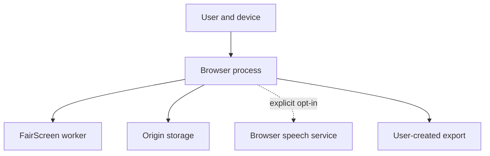

# FairScreen Privacy and Responsible-AI Review

**Version:** 1.0  
**Review status:** Approved with mandatory controls  
**Scope:** Client-side MVP for personal interview practice  
**Not legal advice:** Laws vary by jurisdiction and use context. A production launch or material scope change requires qualified legal/privacy review.

## 1. Review conclusion

FairScreen can proceed as a personal practice and education tool only if it preserves four hard boundaries:

1. no psychological, demographic, identity, integrity, or employability inference;
2. no employer-facing assessment, ranking, or batch workflow;
3. strict technical separation of reviewed answer content from video conditions; and
4. local, minimal, user-controlled media processing and retention.

The Fairness Lab is ethically central: it shows that observable camera conditions can vary while answer content stays the same. It must not claim that a small self-test proves bias in a named vendor or predicts how a third-party system works.

## 2. Why the boundary is necessary

### Scientific validity

Facial movement is not a reliable universal decoder for internal emotion. Barrett and colleagues' major review found that facial movements vary substantially across people, situations, and cultures, and warned against inferring specific emotional states from a facial configuration without context ([Barrett et al., 2019](https://doi.org/10.1177/1529100619832930)).

The same caution applies more strongly to attempted inferences such as honesty, confidence, enthusiasm, personality, or job competence. FairScreen has no validated basis, job-analysis evidence, representative outcome data, or legitimate need for those conclusions.

### Disability and employment risk

Employment software can screen out qualified disabled applicants when it interprets disability-related interaction, speech, movement, sensory, or test-taking differences as negative. U.S. EEOC/DOJ guidance specifically warns that algorithmic hiring tools can violate disability law and emphasizes accommodation and avoiding screen-out effects ([EEOC and DOJ, 2022](https://www.eeoc.gov/newsroom/us-eeoc-and-department-justice-warn-against-disability-discrimination)). This is U.S. guidance, not a complete statement of Canadian or other law, but it identifies a material design harm.

### Regulatory direction

The EU AI Act prohibits specified workplace/education emotion-recognition uses, subject to narrow exceptions. The European Commission's prohibited-practices materials expressly include workplace emotion recognition ([European Commission, 2025](https://digital-strategy.ec.europa.eu/en/events/fourth-ai-pact-webinar-guidelines-prohibited-ai-practices-under-ai-act-and-definition-ai-system); [Regulation (EU) 2024/1689](https://eur-lex.europa.eu/eli/reg/2024/1689/oj/eng)). FairScreen's prohibition is an ethical/product rule independent of whether a particular personal practice use falls within that law.

### Privacy

Canada's Office of the Privacy Commissioner emphasizes necessity, proportionality, transparency, safeguards, retention, and accuracy for biometric initiatives ([OPC business guidance, 2025](https://www.priv.gc.ca/en/privacy-topics/health-genetic-and-other-body-information/biometrics/gd_bio_org-final/)). FairScreen does not identify a person or compare biometric templates, but camera frames, face-derived geometry, voice, transcripts, and recordings can still be sensitive personal information. The safe design is to collect less, process transiently, and avoid retention.

## 3. Responsible-use statement

FairScreen is designed for one adult user practicing their own interview responses. It describes:

- reviewed transcript content;
- timing and audio-signal conditions;
- optional video-call conditions; and
- differences among user-created or synthetic trials.

It is not designed or authorized to:

- assess another person;
- decide who should be interviewed or hired;
- verify identity;
- monitor integrity;
- diagnose any condition;
- infer internal state; or
- automate a third-party interview.

## 4. Potential harms and controls

| Harm | Mechanism | Who may be affected | Severity | Required controls | Residual risk |
| --- | --- | --- | --- | --- | --- |
| **Trait inference by implication** | A percentage or “strong” colour makes users interpret centring/orientation as confidence or competence. | All users; especially anxious applicants | High | Separate content/conditions, no composite score, neutral labels, persistent disclaimer, table definitions, no green/red grading, prohibited-copy tests. | Users may still bring outside assumptions; education must remain prominent. |
| **Disability-related disadvantage** | Detection, timers, speech segmentation, pace, or gaze norms perform differently for disabled/neurodivergent users. | Users with visual, motor, speech, cognitive, facial, neurological, or mental-health differences | High | Camera/mic optional; untimed/extension; manual transcripts; hide metrics; `Not available`; no penalties; condition metrics cannot affect content; accessibility testing with diverse scenarios. | A user may still find the simulation stressful or irrelevant. |
| **Cultural/linguistic norm enforcement** | Filler, direct self-reference, pace, or eye-direction advice privileges one communication style. | Multilingual and culturally diverse users | High | English-only heuristic limitation, cautious wording, collaborative-language safeguards, user-controlled style feedback, no accent/fluency/grammar score, no eye-contact label. | English heuristics may still miss culturally varied but effective structures. |
| **Skin-tone/appearance bias** | Face detection and brightness/backlight estimates vary with model/data/camera conditions. | Racialized users and users with facial differences/coverings | High | No identity/demographic classification, local optional use, broad thresholds, limited-quality wording, diverse fixture review, disable backlight if unsafe, no content effect. | Underlying vendor model behaviour is not fully auditable. |
| **False transcript feedback** | Browser recognition changes names, technical terms, accents, or speech. | All users; disproportionately users with accents/speech differences | High | Explicit remote/accuracy disclosure, transcript review required, manual fallback, retain revision/source, never analyze unreviewed text. | Users may overlook subtle errors when confirming. |
| **Recording exposure** | A saved Blob remains on a shared/lost device or is accessed by another browser-profile user/extension. | Privacy-sensitive users | High | Off by default, enable then save, shared-device warning, size/retention display, independent deletion, no auto-save/upload, no claim of encryption. | Browser-profile compromise remains outside app control. |
| **Context exposure** | Job posting, résumé, transcript, notes, or export reveals personal/confidential data. | User and third parties named in text | High | Local storage, no analytics/network, export field preview, redact/edit, user-initiated export/deletion, safe logs. | Exported files leave FairScreen's control. |
| **Misleading fairness claim** | Four trials are presented as proof a vendor discriminates or as a scientific audit. | Users, vendors, employers | Medium–high | “Descriptive, not causal” notice; no vendor emulation; similarity thresholds visible; seed labeled synthetic; no claim about third-party scoring. | Screenshots may omit the limitation. Include it within exported/chart context. |
| **Performance/anxiety harm** | Model work freezes controls or constant prompts distract the user. | Users on slower devices; anxious/cognitive-disability users | Medium | Worker, frame dropping, limited UI refresh, prompts off by default, hide preview/meters, Stop media, fallback. | Device/browser behaviour varies. |
| **Storage loss** | Browser eviction/private mode clears sessions assumed permanent. | All users | Medium | Call storage best effort, estimate only, export reminders, private-mode notice, quota handling, no guarantee language. | Browser can clear data outside app control. |
| **Employer repurposing** | Code is forked into a screening tool. | Future applicants | High | Explicit prohibited-use notice, no ranking/batch/admin abstractions, single-user architecture, safeguard tests, avoid reusable trait-scoring modules. | Open source cannot technically prevent all forks; license/legal strategy needs later review. |
| **Covert interview assistance** | Practice interface is used during a real interview to supply answers. | Candidate/employer/interview process | Medium | No listening for third-party questions, no real-time generated answers, no overlay/always-on-top/virtual camera, clear practice-only copy. | A user can manually read any prepared notes; product must not facilitate concealment. |

## 5. Bias-risk analysis

### 5.1 MediaPipe and face-condition metrics

The MVP uses MediaPipe Face Landmarker to obtain geometry, not identity. That does not remove bias risk:

- detection can vary with lighting, camera quality, pose, occlusion, face covering, assistive equipment, facial difference, skin tone, age, movement, and the model's training data;
- `numFaces` is a model return, not ground truth;
- transformation matrices are intended for effects geometry, not validated employment assessment;
- the web task remains a vendor preview and can change.

Required response:

- do not claim demographic parity;
- do not store demographic labels;
- do not ask users to self-identify demographics for the MVP;
- test diverse licensed/synthetic fixtures without creating a user biometric dataset;
- publish limitations and model/version;
- allow independent disablement;
- default to unavailable when uncertain.

NIST has documented demographic differentials in many face-recognition algorithms ([NISTIR 8280](https://doi.org/10.6028/NIST.IR.8280)). FairScreen is not doing recognition, so those measured error rates cannot be transferred to Face Landmarker. The report is relevant as evidence that face-processing performance cannot be assumed uniform across demographics, not as a claim about this model's exact performance.

### 5.2 Brightness/backlighting

Whole-frame exposure is safer than judging “face illumination,” but a face-region/background comparison can still interact with skin tone, clothing, hair, background, and camera exposure.

Controls:

- label as sampled-frame exposure;
- use broad luma categories;
- make the face/background backlight rule a feature flag;
- require diverse-fixture review;
- disable calculated backlighting if false positives or wording cannot be made acceptable;
- retain user-authored condition labels and seeded demo so the Fairness Lab does not depend on this calculation.

### 5.3 Audio and speech

RMS, VAD, pause, filler, and WPM values vary with:

- microphone hardware and automatic gain;
- room noise;
- hearing/speech devices;
- disability;
- language, dialect, accent, and code-switching;
- deliberate pacing and reflection;
- recognition-provider omissions.

Controls:

- signal thresholds are session-calibrated and transparent;
- all-zero signal is not called silence;
- WPM requires a reviewed transcript;
- speech/style results are optional and separate;
- no accent, fluency, professionalism, emotion, or cognitive inference;
- no content penalty.

### 5.4 Text heuristics

Keyword and cue detection can reward formulaic English or first-person self-promotion.

Controls:

- every result says detected/not detected rather than true/false;
- evidence spans are visible;
- collaborative-language cues count;
- STAR is not applicable to non-behavioural questions;
- quantitative evidence is optional;
- user can edit/redact transcript;
- no grammar/sentiment/vocabulary prestige;
- fixtures include collaborative, culturally varied, concise, verbose, dialectal, and disability-related communication examples;
- publish heuristic version.

## 6. False-inference risk register

| Observation | Forbidden inference | Approved interpretation |
| --- | --- | --- |
| Face not detected consistently | User hid face, was unprofessional, disengaged, or deceptive | The selected model did not consistently return a face-like landmark set under these captured conditions. |
| Position outside centre guide | Lack of focus/confidence | Camera/frame geometry differed from the broad guide. |
| Head orientation outside band | Bad eye contact, inattention, reading notes | Approximate orientation differed from session calibration; displayed-question/camera offset may explain it. |
| Multiple face-like regions | Cheating or another person assisting | The model returned more than one region; background images/screens can affect it. |
| Dim/bright frame | Poor presentation or unsuitable environment | Sampled pixels fell into a broad exposure category. |
| Long pause | Nervousness, dishonesty, cognitive difficulty | Signal stayed below the session threshold for an estimated interval. |
| Low microphone level | Quiet personality or poor communication | Captured signal energy was low on this hardware/setup. |
| Fast/slow WPM | Intelligence, fluency, confidence | Approximate pace based on reviewed word count and detected speech time. |
| Filler word | Lack of knowledge | A listed phrase appears in the reviewed transcript; recognition may omit/add it. |
| No numeric result | No achievement | A contextual measurement was not detected; numbers may be inappropriate or confidential. |

## 7. Privacy threat model

### 7.1 Assets

- Live camera frames.
- Live audio samples.
- Face-derived geometry.
- Recordings.
- Raw and reviewed transcripts.
- Job descriptions and résumé text.
- User notes.
- Aggregate metrics.
- Browser/device capability and preferred device identifiers.
- Exported files.

### 7.2 Trust boundaries

### 7.3 Threats

| Threat | Scenario | Control | Residual risk |
| --- | --- | --- | --- |
| XSS/dependency compromise | Malicious code reads local transcripts/recordings or camera stream. | No remote runtime code, restrictive CSP, React text rendering, dependency lock/review, no user HTML, minimal dependencies, security updates. | First-party supply-chain compromise remains possible. |
| Shared browser profile | Another household/user opens Saved sessions. | Clear local/shared-device notice, recordings off, deletion, hide sensitive previews, no auto-open last transcript. | No account/PIN encryption in MVP. |
| Malicious browser extension | Extension reads page/IndexedDB/media. | Disclose device/browser boundary; minimize retention. | App cannot control privileged extensions. |
| Background capture | User believes capture stopped after navigation/error/tab hide. | Persistent indicators, global Stop, ResourceRegistry, state-limited capture, stop on route/error/hidden policy, tests. | Browser finalization timing can be asynchronous; UI must wait or label. |
| Accidental remote speech | User assumes all analysis is local. | Separate disclosure immediately before browser recognition; default manual; processing mode local/remote/unknown. | Browser may not fully disclose its provider behaviour. |
| Over-retention | Recordings accumulate until quota or exposure. | Enable then save, size display, deletion, soft warning, no automatic retention. | Users may deliberately retain large data. |
| Storage eviction | User loses sessions. | Best-effort language, estimate, persistence request only on demand, export. | Browser remains final authority. |
| Export disclosure | User shares résumé/transcript/notes unintentionally. | Field selection and sensitive-data preview; recording excluded; sanitized filenames. | User controls file after download. |
| Fingerprinting | Capability/device data forms a persistent browser fingerprint. | Do not persist UA; only session-relevant status; no analytics/network; device IDs only opt-in. | Browser APIs inherently expose some device information after permission. |
| Worker leakage | Raw landmarks/pixels cross worker boundary or logs. | Narrow protocol, structural validator, transfer and close bitmap, repository guard, tests. | Vendor/WASM operates within the browser process. |
| Data remanence | Deleting IndexedDB does not securely erase physical storage. | Say “remove from this browser,” not secure wipe; avoid cryptographic guarantees. | Browser/OS backups and storage internals are outside app control. |

## 8. Complete data lifecycle

| Data | Collection trigger | Processing | Cross-boundary transfer | Persistence | Export | Deletion |
| --- | --- | --- | --- | --- | --- | --- |
| **Camera frames** | User chooses camera and grants browser permission; analysis separately enabled. | Current frame converted/transferred to worker at ≤10 fps; MediaPipe and luma calculation. | Main thread → worker for current sample only. Never network. | Never. | Never. | Bitmap closed and references discarded immediately; track stopped on exit. |
| **Audio samples** | User chooses microphone and grants permission. | Web Audio RMS/dBFS/VAD in memory. | Microphone graph → local analyzer. Browser speech may separately receive audio after explicit opt-in. | Raw samples never. Aggregate segments/metrics may persist with response. | Aggregate only if selected. | Arrays reused/released; track/context stopped; aggregates delete with response/session. |
| **Face landmarks** | Only while video analysis worker processes a frame. | Bounding geometry/orientation aggregate inside worker. Blendshapes disabled. | Must not leave worker; only sanitized observation. | Never. | Never. | References cleared after current frame; matrix/landmarks not logged. |
| **Transcripts** | Browser recognition after disclosure or user manual entry/edit. | Interim/final recognition text remains transient through review; deterministic analysis uses only the reviewed revision. | Browser service may process remotely; FairScreen sends to no server. | Reviewed revision plus limited technical provider/error metadata; no duplicate unreviewed transcript or interim segments. | User-selected reviewed text. | Transient text clears after review/exit; persisted revision deletes with response/session/all data. |
| **Interview metrics** | Finalization of answer/trial. | Aggregate/version/limitations created. | Domain services → repository; no network. | IndexedDB with response/trial. | User-selected text/JSON/print. | Delete owner/all data. |
| **Recordings** | User enables capture before answer. | MediaRecorder chunks/Blob in memory; local playback. | Browser media → memory; no network. | Only after explicit post-review Save. Blob in IndexedDB. | Not embedded in report exports. A future separate media-download flow is out of MVP. | Discard transient Blob, delete saved recording independently/with owner/all data, revoke URLs. |
| **Session data** | User creates/saves local session. | Questions, context, settings snapshot, notes, references. | React/domain → IndexedDB; no network. | Best-effort origin IndexedDB. | User-selected projection. | Individual/all-data deletion; may also be cleared/evicted by browser. |
| **Job description/résumé** | Job description is typed by the user. Resume text enters only after a user-selected PDF, DOCX, or TXT file is parsed locally and the user confirms the extracted plain text. | Local keyword extraction and question adaptation; reviewed transcript analysis may use rendered question only. | No network. | With session snapshot after create. | Excluded unless user selects session context. | Delete session/all data. |
| **Capabilities/device preference** | Capability scan and optional remembered device choice. | Determine fallbacks; no overall score. | Browser → memory/settings. | Capability snapshot optional; device ID only if user asks to remember. | Technical support output only after action; default report omits raw identifiers. | Reset settings/all data; IDs may rotate. |
| **Exports** | User selects format/fields and confirms. | Local projection and serialization/print. | Browser download/print boundary under user control. | Outside FairScreen after save; no export log by default. | The export is the output. | User deletes external file; FairScreen can only revoke temporary object URL. |

### 8.1 M07.2 resume file import lifecycle

Resume file import is user-triggered from setup. PDF, DOCX, and TXT files are
parsed locally in the browser to plain text. The original `File`, document
bytes, DOCX archive, PDF page objects, parser buffers, filenames, metadata, and
errors that might contain user content are not persisted, exported, logged, or
stored in React/domain state. Password-protected, image-only, corrupt, empty,
legacy DOC, unsupported, oversized, and excessive-text files fail with generic
guidance. Extracted text is staged only in transient UI state until the user
confirms **Use this resume**. Only the user-confirmed plain text in `resumeText`
may later be saved with a session snapshot or included in a user-selected export.

### 8.2 M08.3 job posting and company research lifecycle

Job posting URLs, company names, company website URLs, and job descriptions are
setup context. Typing or editing these fields must not fetch remote pages. Job
posting import is an explicit action and company research requires first-use
consent before a provider request.

The consent copy must state that a provider request may include only company
name, company website URL, job title, and job posting URL. It must also state
that FairScreen does not send resume text or files, answers, recordings, notes,
transcripts, camera data, microphone data, saved sessions, or local file paths
for company research.

The browser bundle contains only typed provider ports and unavailable defaults.
A real provider must run outside the browser bundle, keep credentials
server-side, block non-HTTP/S and private-network targets, enforce redirect,
size, content-type, timeout, and rate limits, sanitize fetched markup without
scripts or subresources, and avoid logging private practice data. Provider
failures must preserve setup fields and local question generation.

Imported job fields and company research findings are reviewable before use.
Users can edit, include/exclude, inspect sources, refresh, delete, or continue
without research. Only reviewed URL metadata, safe source attribution,
timestamps, and included findings may feed local question generation or persist
with a session snapshot. Raw fetched pages, provider credentials, scripts,
tracking assets, and private practice data must not persist.

## 9. Storage and retention policy

### Defaults

- No cookies.
- No analytics.
- No remote error reporting.
- No account.
- No video/frame/landmark storage.
- No PCM storage.
- Recording capture off.
- Recording persistence requires explicit post-review save.
- Browser speech off unless chosen after disclosure.
- Settings and saved text/metrics use IndexedDB.

### Browser limitations

IndexedDB is origin-scoped and supports structured data and blobs, but browser storage is best-effort by default. Quotas and eviction differ; private-session data is normally removed when that session ends ([MDN IndexedDB](https://developer.mozilla.org/en-US/docs/Web/API/IndexedDB_API), [MDN storage quotas](https://developer.mozilla.org/en-US/docs/Web/API/Storage_API/Storage_quotas_and_eviction_criteria)).

Required copy:

`Stored locally` must never be expanded to:

- encrypted;
- permanent;
- guaranteed;
- inaccessible to other users of this browser profile;
- inaccessible to extensions;
- securely erased.

## 10. Consent and choice design

### Separate choices

1. Use camera.
2. Use microphone.
3. Run local face-condition analysis.
4. Use browser speech recognition after remote-processing disclosure.
5. Capture a recording in memory.
6. Save that recording on this device.
7. Include sensitive fields in export.
8. Request persistent browser storage.
9. Request company research after the field-disclosure consent.

No choice bundles another. No prechecked recording/speech. Declining does not create repeated nagging.

### Not dark patterns

- Primary limited-mode actions are visually available.
- Privacy text is adjacent, not buried.
- “Continue without camera” is not styled as a warning.
- Deleting/exporting is not hidden.
- Consent is not a condition of content coaching.
- The product does not say enabling more sensors improves an answer score.

## 11. Misuse cases

| Misuse | Preventive design | Required response if requested later |
| --- | --- | --- |
| Employer asks candidates to submit FairScreen report | Reports state personal coaching only; no verification or candidate ID; no share link. | Reject employer assessment workflow and document boundary. |
| Recruiter batch uploads applicant videos | No import/batch/admin/identity model. | Reject as outside product and prohibited use. |
| User wants honesty/emotion/confidence score | No trait interfaces or data. | Explain unsupported inference; offer transcript/content coaching. |
| User wants eye-redirection/virtual camera | No output/camera manipulation. | Reject; offer legitimate camera-position practice tips. |
| User wants prerecorded injection | No third-party integration. | Reject; offer mock practice/retry. |
| User wants hidden answers during real interview | No live external-question listener or answer overlay. | Reject; offer pre-interview question practice. |
| User names a vendor and wants proof its model is biased | Fairness Lab is model-agnostic and descriptive. | State limits; suggest independent audit/research process, not simulate vendor scoring. |
| User records someone else without consent | Single-user copy and no background capture. | Require appropriate consent/use; do not add covert recording. |
| Developer proposes demographic parity collection | No demographics in MVP. | Require new necessity/privacy/legal/ethics review and explicit user choice; do not add casually. |

## 12. Prohibited features

The following are architectural stop conditions:

- facial-expression or blendshape emotion labels;
- sentiment used as emotion/personality;
- truthfulness/deception;
- confidence/enthusiasm;
- Big Five or other personality;
- attention/engagement;
- actual gaze/eye-contact claim;
- attractiveness/professional appearance;
- age, sex/gender, race/ethnicity, disability, health, religion, or other sensitive categorization;
- identity match/face embedding;
- voiceprint;
- accent/dialect prestige;
- native-language inference;
- cognitive ability from pause/speech;
- cheating/proctoring;
- candidate/job-fit score;
- rank/percentile/threshold recommendation;
- automated accept/reject;
- cross-user comparison;
- employer dashboard;
- remote monitoring;
- background capture;
- hidden assistance or third-party automation.

## 13. Safe-language guide

| Avoid | Use |
| --- | --- |
| `AI judged/analyzed you` | `FairScreen applied a documented local text rule` |
| `Eye contact` | `Near-camera orientation` |
| `You looked away 40% of the time` | `Estimated head orientation was outside the broad calibration band in some sampled frames` |
| `Face visibility score` | `Face-like shape detection percentage` |
| `Good/bad framing` | `Within/outside the broad framing guide` |
| `Confident volume` | `Captured microphone level` |
| `Awkward pause` | `Estimated internal pause` |
| `Strong candidate` | `The reviewed transcript contains specific evidence` |
| `You failed to give a result` | `A specific outcome was not detected in the reviewed text` |
| `Professional` | State the concrete setup/content observation |
| `Bias proven` | `This small comparison is descriptive and cannot establish causality or audit a third-party model` |
| `Private/secure` without qualification | `Processed in this browser`, `stored in this browser`, plus limitations |

## 14. Required disclaimers

### Global report warning

> Camera position, gaze direction, lighting, facial movement, disability, culture, anxiety, and hardware setup are not reliable measures of job competence. Visual measurements are provided only to help users understand video-call conditions.

### Fairness invariance statement

> The answer content remained unchanged. Differences in video conditions should not be interpreted as differences in competence.

### Fairness limitation

> This is a descriptive self-comparison, not an audit of a hiring platform. A small number of trials cannot establish causality, reveal a third-party model's scoring, or prove discrimination.

### Speech-recognition disclosure

> Browser speech recognition is optional and is not available everywhere. Depending on your browser, audio may be sent to the browser vendor or another recognition service. Review and edit the transcript before FairScreen analyzes it, or choose a manual transcript instead.

### Local-storage disclosure

> FairScreen stores saved sessions in this browser. Browser storage is best effort: it may be cleared by you or the browser, and private-browsing data is usually removed when the private session ends. Other people using this browser profile may be able to open saved data.

### Recording disclosure

> Recording is off by default. If you enable it, the completed recording stays in memory for review and is saved in this browser only when you choose “Save recording on this device.”

### Deterministic-analysis disclaimer

> FairScreen uses documented wording patterns in the reviewed transcript. It may miss context or interpret a phrase incorrectly. “Detected” means the text matched a rule, not that FairScreen verified the event or assessed your suitability.

## 15. Accessibility impact review

| Requirement | Responsible-AI rationale |
| --- | --- |
| Untimed/adjustable/extendable timing | Time pressure can exclude users with visual, motor, cognitive, speech, anxiety, and assistive-technology needs. WCAG recommends user control over time limits ([W3C SC 2.2.1](https://www.w3.org/WAI/WCAG22/Understanding/timing-adjustable.html)). |
| Camera and microphone optional | Sensory, motor, speech, privacy, hardware, bandwidth, and cultural needs vary. |
| Manual transcript | Recognition is limited and can misrepresent accents, names, technical language, and speech differences. |
| Disable live prompts/meters/preview | Reduces cognitive load, distraction, self-consciousness, and screen-reader noise. |
| Neutral `Not available` | Lack of measurement is not user failure. |
| No colour-only/animated score | Avoids grading pressure and supports visual/cognitive accessibility. |
| No gaze/movement misconduct | Disability and natural behaviour must not be treated as integrity evidence. |
| Table equivalents | Canvas/SVG comparison must not withhold meaning from screen-reader users. |

## 16. Governance and change control

### Protected boundaries

Any change involving one of these requires a decision-log entry and privacy/responsible-AI re-review:

- new sensor or raw-data source;
- new model;
- new inferred category;
- storage of frame-, landmark-, voice-, or identity-like data;
- external provider/network transmission;
- user accounts/synchronization/sharing;
- employer/recruiter use;
- cross-user benchmarking;
- changes to content/condition separation;
- analytics/telemetry;
- demographic data;
- recording/export behaviour;
- licensing or hosting change affecting data access.

### Required review questions

1. Is the feature necessary for personal interview practice?
2. Can the goal be met with less or no personal data?
3. Does it create or imply a psychological/employment inference?
4. Is there a camera/mic-free equivalent?
5. What groups may experience worse performance or harm?
6. Is the result valid for the claimed purpose?
7. Can users understand, decline, correct, delete, and export it?
8. Can it be repurposed for assessment or surveillance?
9. What is retained, transmitted, logged, and exposed to dependencies?
10. What test would fail if the protected boundary were crossed?

## 17. Release review checklist

- [ ] No prohibited model, field, label, copy, chart, or workflow.
- [ ] `AnswerAnalyzer` accepts no video input.
- [ ] Audio style cannot change content evidence.
- [ ] Raw frames/audio/landmarks are absent from persistence and diagnostics.
- [ ] MediaPipe assets are same-origin and lazy.
- [ ] Browser speech disclosure precedes start.
- [ ] Transcript review precedes analysis.
- [ ] Camera/mic denial leaves a complete workflow.
- [ ] Recording requires enable then save.
- [ ] Shared-device, eviction, and export risks are visible.
- [ ] Fairness demo is synthetic and permission-free.
- [ ] Fairness report does not claim causality/vendor audit.
- [ ] Required warnings appear in UI, print, text, and JSON.
- [ ] Accessibility alternatives and timing control pass.
- [ ] Backlight feature remains off unless diverse-fixture review passes.
- [ ] Dependency/network scan finds no tracker or remote runtime asset.
- [ ] Error/diagnostic payloads contain no user content.
- [ ] Delete-all and individual deletion are verified.
- [ ] Known limitations and algorithm/model versions are published.
