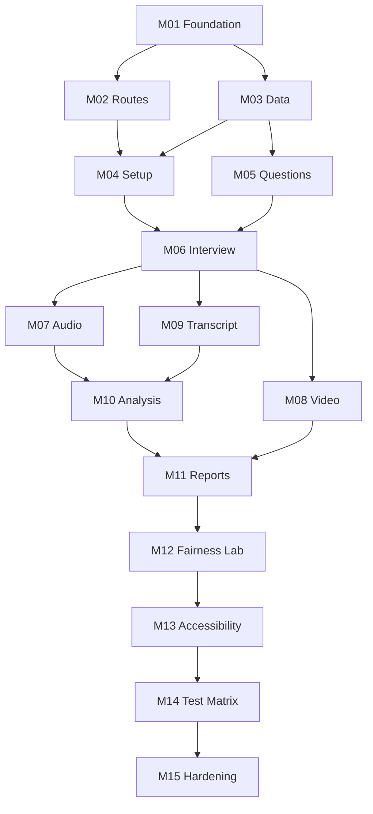

# FairScreen Implementation Roadmap

**Version:** 1.0  
**Date:** 2026-07-28  
**Status:** Implementation-ready  
**Primary requirements source:** [02_FairScreen_PRD.md](02_FairScreen_PRD.md)

## 1. How to use this roadmap

The roadmap divides the MVP into 15 reviewable milestones. Each milestone is intended to fit one focused Codex task and to end with a buildable, testable repository. Complete milestones in order unless a dependency explicitly permits parallel work.

Every milestone must preserve these non-negotiable boundaries:

- The application is client-only and has no application backend.
- Camera, microphone, recording, and browser speech recognition are optional and off until the user acts.
- Video observations describe capture conditions only. They never affect answer-content analysis.
- No identity, emotion, personality, demographic, disability, medical, honesty, intent, employability, confidence, or competence inference is allowed.
- No overall or combined performance score is allowed.
- Raw frames, landmarks, matrices, blendshapes, and PCM arrays are transient.
- A recording is persisted only after a second, post-capture save choice.
- Same-origin packaged assets, no analytics, no tracking, no secret in the client.
- Every optional API has a tested fallback.

### 1.1 Milestone completion protocol

For every milestone:

1. Read the linked specification sections and requirement IDs.
2. Confirm the preceding milestone passes before editing.
3. Implement only the stated `Includes`.
4. Add or update automated tests named in `Tests`.
5. Run formatting, lint, type-check, unit/component tests, and the milestone-specific checks.
6. Update implementation notes and the decision log if a protected boundary changes.
7. Record browser/manual evidence where the milestone requires it.

No milestone is complete while a listed acceptance criterion is unverified.

## 2. Dependency sequence

## 3. Milestones

### M01 — Repository foundation and design system

**Goal:** Establish a strict, accessible, static React application shell and the automated quality floor.

**Includes**

- Vite, React, TypeScript, Tailwind CSS, React Router, Lucide React, Vitest, Testing Library, Playwright, `axe-core`, ESLint, Prettier, and Zod.
- Strict TypeScript flags: `strict`, `noUncheckedIndexedAccess`, `exactOptionalPropertyTypes`, and `useUnknownInCatchVariables`.
- Hash-router-compatible application shell, global error boundary, semantic skip link, page container, and empty route placeholders.
- Tailwind theme extensions backed by CSS custom-property design tokens, a system font stack, default/high-contrast themes, reduced-motion handling, focus styles, and a print baseline.
- CI commands for install, formatting check, lint, type-check, unit/component tests, production build, prohibited-language scan, dependency audit, and browser smoke test.
- Repository documentation skeleton and specification version reference.

**Excludes**

- Complete pages, domain persistence, permissions, media capture, analysis, and deploy-provider configuration.

**Likely files/modules**

`package.json`, `vite.config.ts`, `tsconfig*.json`, `eslint.config.js`, `playwright.config.ts`, `src/app/*`, `src/styles/*`, `src/shared/components/*`, `src/shared/test/*`, `scripts/check-prohibited-language.mjs`, `.github/workflows/ci.yml`, `README.md`, `docs/`.

**Requirement IDs**

NFR-001–NFR-002, NFR-004, NFR-007, NFR-009–NFR-010, NFR-012–NFR-014; ACC-001–ACC-003, ACC-008–ACC-011, ACC-019; PRIV-011, PRIV-013, PRIV-016; ERR-014.

**Acceptance criteria**

- `npm run build` produces a static bundle and route smoke tests work under a non-root base path.
- Type-check and lint reject explicit `any`; source has no untyped browser boundary.
- Keyboard focus, skip link, reduced motion, contrast tokens, and 320 px shell reflow have tests.
- No third-party runtime request, analytics dependency, remote font, or secret-shaped value exists.
- The prohibited-language scanner has a failing fixture and an allowlist limited to policy/documentation contexts.
- A route-level error boundary stops registered resources through an injectable registry.

**Tests**

- Unit: token/theme helpers, resource registry, error-code formatting.
- Component: shell landmarks, skip link, route heading focus, high contrast, error boundary.
- Browser: static deep-link/hash smoke, keyboard smoke at 320 px and desktop.
- Audit: dependency/source/network allowlist and secret scan.

**Dependencies:** None.

**Risks**

- Tooling additions can silently introduce runtime origins; keep all runtime assets local.
- A generic language scan can flag explanatory policy copy; require a reviewed contextual allowlist.

**Manual steps**

- Confirm package licenses are compatible.
- Review token contrast with a contrast calculator.
- Decide the final static host only after M15 headers are verified; do not buy or configure a paid service here.

---

### M02 — Routing, navigation, and static education pages

**Goal:** Deliver the complete navigational structure and truthful product education without device access.

**Includes**

- Routes for Home, Setup, Device Check, Interview, Report, Saved Sessions, Fairness Lab, Settings, Privacy, Methodology, Accessibility, and Not Found.
- Responsive global navigation, breadcrumbs where useful, page-heading focus management, footer privacy summary, and persistent safe Exit pattern.
- Home, Privacy, Methodology, and Accessibility content, including the approved fairness boundary and local-first explanation.
- Reusable status, notice, disclosure, limitation, and empty-state components using exact UX copy.

**Excludes**

- Functional setup form, database operations, media prompts, session execution, or analysis.

**Likely files/modules**

`src/app/router.tsx`, `src/app/routes.ts`, `src/shared/layout/*`, `src/shared/components/{Notice,Status,Disclosure,EmptyState}*`, `src/features/education/*`, `src/pages/*`.

**Requirement IDs**

FR-001–FR-002; NFR-004, NFR-007, NFR-014; ACC-001–ACC-005, ACC-008–ACC-011, ACC-016, ACC-019; PRIV-009, PRIV-013, PRIV-017.

**Acceptance criteria**

- Every sitemap route renders a unique title, `<h1>`, navigation state, and useful no-JavaScript/static-host fallback where applicable.
- The landing page communicates both workflows, local-first handling, limitations, and “Practice the interview. Question the scoring.”
- No page suggests that visual signals reveal competence or a trait.
- Route changes announce once and focus the page heading without disrupting back-button behavior.
- All education routes print legibly and remain functional at 320 CSS px and 200% zoom.

**Tests**

- Component: each route landmark, exact critical copy, link targets, disclosure expansion.
- Browser: keyboard navigation, back/forward focus behavior, unknown route, responsive navigation, print snapshot.
- Policy: prohibited-feature and prohibited-copy scan.

**Dependencies:** M01.

**Risks**

- Repeating disclaimers can obscure the primary task; use the placement rules in the UX Specification.
- Hash fragments must not conflict with in-page disclosure links.

**Manual steps**

- Perform a plain-language and responsible-AI copy review.
- Verify VoiceOver/Safari and NVDA/Chrome page-title and heading announcements.

---

### M03 — Domain models, validation, IndexedDB, and demo-data boundaries

**Goal:** Implement versioned, recoverable local persistence behind typed ports.

**Includes**

- Domain types and enums from the Domain Models document.
- Zod schemas at persistence, import/export, configuration, and worker-message boundaries; TypeScript types remain canonical within the domain.
- IndexedDB schema, ordered idempotent migrations, repositories, transactions, indexes, and cascade rules.
- Ephemeral in-memory repository with the same port.
- Corrupt-record quarantine/read-only recovery and future-schema recovery behavior.
- Settings defaults, session snapshots, namespaced deterministic demo records, approximate storage estimate, scoped deletion, and all-data deletion.
- Injectable ID, clock, random, and storage ports.

**Excludes**

- User-facing saved-session pages, media blobs from real recordings, content analysis, and imports from arbitrary external sources.

**Likely files/modules**

`src/domain/*`, `src/infrastructure/storage/{db,migrations,repositories,ephemeral,schemas}/*`, `src/infrastructure/browser/storageEstimate.ts`, `src/features/settings/defaults.ts`, `src/features/demo/seed.ts`.

**Requirement IDs**

FR-033–FR-037, FR-044–FR-045, FR-049–FR-050; NFR-002, NFR-005–NFR-006, NFR-010, NFR-013; PRIV-009–PRIV-012, PRIV-014, PRIV-017; ERR-009–ERR-010.

**Acceptance criteria**

- Repository interfaces are usable without importing IndexedDB types into feature/domain code.
- Migrations are ordered, idempotent, transaction-safe, and tested from every supported prior version.
- Failed writes never report success; quota errors retain the active response in memory and expose recovery actions.
- Corrupt records are isolated without deleting the database.
- Demo load is idempotent and demo delete cannot remove user records.
- Cascade tests prove the exact dependent records removed for every deletion scope.
- Settings reset and data deletion are separate operations.

**Tests**

- Unit: schemas, invariants, migrations, cascade plan, query/filter normalization, filenames.
- Integration: real IndexedDB test environment, blocked/open failure, transaction abort, quota simulation, future version, corrupt record.
- Property/fixture: round-trip all domain models and deterministic demo seed.

**Dependencies:** M01.

**Risks**

- Blob quotas and eviction differ by browser; never imply guaranteed persistence.
- A migration bug could damage user data; keep recovery/export possible and test every version edge.

**Manual steps**

- Inspect stored records in at least Chrome, Firefox, and Safari developer tools.
- Verify private-browsing behavior is described rather than assumed.

---

### M04 — Setup, capability report, permissions, and device check

**Goal:** Let a user configure practice and safely discover optional browser/device capability.

**Includes**

- Complete setup form, validation, defaults, custom-question draft entry, and unsaved-navigation protection.
- Capability service and report with `supported`, `limited`, `unsupported`, `blocked`, and `unknown`.
- Separate just-in-time camera and microphone requests, device enumeration refresh, selectors, preview, mirror-display toggle, preview visibility, text-equivalent microphone meter state, and global Stop media.
- Limited-mode summary and ephemeral-mode option.
- Track/audio graph cleanup on replace, route leave, error, page hide where practical, and teardown.

**Excludes**

- MediaPipe checks, recorded answer execution, recording, speech recognition, and persisted response metrics.

**Likely files/modules**

`src/features/setup/*`, `src/features/device-check/*`, `src/infrastructure/browser/{capabilities,mediaDevices,audioContext,permissions}/*`, `src/shared/media/resourceRegistry.ts`.

**Requirement IDs**

FR-003–FR-009, FR-011–FR-012, FR-021, FR-036; NFR-004–NFR-005, NFR-008, NFR-010–NFR-011; PRIV-001, PRIV-006, PRIV-011, PRIV-014–PRIV-015; ACC-002–ACC-016, ACC-019; ERR-001–ERR-004, ERR-006, ERR-009, ERR-014.

**Acceptance criteria**

- No device prompt occurs on route load or capability re-check.
- Denial/dismissal preserves setup data and provides camera-only, microphone-only, or neither paths.
- Default devices work before labels are exposed; selectors refresh after permission.
- Replaced/abandoned tracks stop and AudioContext resources disconnect/close.
- Capability report never converts `unknown` into `unsupported` and reports MIME candidates independently.
- Text and accessible-name equivalents describe microphone activity without relying on animation or color.

**Tests**

- Unit: capability normalization, constraint fallback, setup schema.
- Component: every permission state, selected-device refresh, limited-mode summary, cleanup effects.
- Browser/manual: grant, deny, dismiss, no-device, busy-device, revoked permission, track end, multiple inputs, insecure-context fixture.

**Dependencies:** M02, M03.

**Risks**

- Browser permission automation is incomplete, especially Safari; retain a manual evidence matrix.
- Device labels and permission APIs vary; status must reflect observed capability rather than guess.

**Manual steps**

- Test real camera/microphone combinations in supported desktop browsers.
- Confirm browser indicators disappear after global Stop and navigation.

---

### M05 — Deterministic local question generation

**Goal:** Generate editable, role-relevant interview sets entirely on device.

**Includes**

- At least 60 reviewed built-in templates across the five required banks.
- Metadata validation, normalized duplicate detection, deterministic role-term extraction, stop words, weights and source attribution.
- Seeded selection by category, difficulty, role terms, and fallback rules.
- Add/edit/remove/reorder custom questions and snapshot the final set.
- Typed `QuestionProvider` local implementation and test fake.

**Excludes**

- Remote or generative-AI providers, interview execution, and answer analysis.

**Likely files/modules**

`src/features/questions/{catalogue,extractor,selector,normalization,LocalQuestionProvider}/*`, `src/features/setup/question-editor/*`.

**Requirement IDs**

FR-013–FR-016, FR-046–FR-047; NFR-002, NFR-006–NFR-007, NFR-010; PRIV-002, PRIV-014, PRIV-016; ERR-013.

**Acceptance criteria**

- Tests count at least 60 unique valid built-in IDs with at least 12 per required bank.
- Same normalized input and seed yields deep-equal selection/order.
- No normalized duplicate appears; exhaustion returns documented safe fallbacks.
- Extracted terms are capped, stop-word filtered, reproducible, non-sensitive by rule, and carry source/weight.
- Custom questions validate emptiness and duplicates; one valid final question is required.
- Page components depend only on the provider port.

**Tests**

- Unit/fixture: catalogue schema, uniqueness, extraction boundaries, seed reproducibility, fallback exhaustion, custom reorder.
- Mutation-style assertions: changing seed can change order; changing only company does not invent a role requirement.

**Dependencies:** M03.

**Risks**

- Keyword relevance can be overstated; label selection as template matching, not semantic understanding.
- Résumé and job-description content is sensitive; prevent it from entering logs or diagnostics.

**Manual steps**

- Editorially review all 60+ prompts for category, neutrality, difficulty, and duplicates.

---

### M06 — Interview state machine and timer controls

**Goal:** Deliver a complete camera-free, microphone-free interview workflow with resilient state and timing.

**Includes**

- Pure interview reducer/state machine for `ready`, `preparing`, `answering`, `reviewing`, `betweenQuestions`, and `complete`.
- Flexible, strict-practice, and untimed modes; sparse announcements; warnings; extension; overtime; pause behavior defined by the UX specification.
- Start, finish, repeat, skip, end, extend, hide-preview placeholder, and Stop media controls as state permits.
- Safe refresh/resume into a non-capturing state, completion snapshots, retry attempts, and attempt selection for report display.
- Resource-registry events without implementing analyzers.

**Excludes**

- Real audio/video capture, transcription, content analysis, and finished report.

**Likely files/modules**

`src/features/interview/{machine,reducer,timer,selectors,components}/*`, `src/pages/InterviewPage.tsx`.

**Requirement IDs**

FR-017–FR-021, FR-031, FR-035; NFR-004–NFR-006, NFR-010; PRIV-015; ACC-002–ACC-007, ACC-010, ACC-015–ACC-016, ACC-019; ERR-004, ERR-014.

**Acceptance criteria**

- Transition-table tests cover every valid and invalid state/event pair.
- Strict mode cannot be selected accidentally, warns before end, and exposes one-action extension.
- Flexible mode never hard-stops; untimed mode contains no hidden countdown.
- Timer announcements occur only at documented boundaries and can be silenced.
- Double activation cannot create duplicate attempts or transitions.
- Refresh recovery never restarts capture or an active timer.
- Camera-free/manual response path reaches Complete.

**Tests**

- Unit: transition table, timer with fake clock, visibility changes, extension, double events, recovery.
- Component/browser: keyboard-only entire session, route exit confirmation, refresh, skip/repeat/end, 320 px controls.

**Dependencies:** M04, M05.

**Risks**

- UI timers drift when tabs are throttled; derive display from monotonic timestamps instead of tick counts.
- Strict timing can exclude users; keep it explicit, extendable, and never the default.

**Manual steps**

- Conduct a keyboard and screen-reader walkthrough of all six states.

---

### M07 — Audio capture and approved audio metrics

**Goal:** Add optional local audio observations without storing PCM or making trait claims.

**Includes**

- Browser audio port, calibration phase, 20 Hz sampling, RMS and dBFS conversion, noise floor, adaptive VAD, speech segments, approved aggregates, partial/unavailable states, and algorithm version.
- Microphone selection integration, active-capture indication, user-activated AudioContext resume, cleanup, and failure fallback.
- Optional MediaRecorder capture negotiation and transient post-capture blob review; save action may persist only after explicit confirmation.
- Recording delete and object-URL lifecycle.

**Excludes**

- Speech-to-text, video metrics, content analysis, or interpretation of voice as confidence/emotion/fluency.

**Likely files/modules**

`src/features/audio/{sampler,calibration,vad,aggregate}/*`, `src/features/recording/*`, `src/infrastructure/browser/{webAudio,mediaRecorder}/*`.

**Requirement IDs**

FR-008–FR-009, FR-019, FR-021–FR-022, FR-033, FR-048–FR-049; NFR-005–NFR-008; PRIV-001–PRIV-002, PRIV-006, PRIV-008, PRIV-014–PRIV-015, PRIV-017; ACC-005, ACC-011, ACC-014–ACC-017; ERR-002–ERR-004, ERR-006, ERR-008–ERR-009.

**Acceptance criteria**

- Fixture calculations match the Measurement Specification within stated tolerance.
- Raw time-domain arrays are reused/released and are absent from state, logs, persistence, and exports.
- Zero samples produce `notAvailable`, never a fabricated zero metric.
- Recording is off by default; enabling capture does not imply save; no Blob enters IndexedDB before “Save recording on this device.”
- MIME type is selected using feature detection and actual recorder failure remains recoverable.
- All audio tracks, nodes, contexts, recorders, URLs, and timers clean up under every exit/error path.

**Tests**

- Unit: RMS/dBFS, adaptive threshold, VAD segmentation, pauses, clipping, no-sample and partial cases.
- Integration: suspended context, recorder unsupported/error/zero-byte, quota-on-save, cleanup registry.
- Browser/manual: quiet/noisy rooms, headset switch, silence, mic removal, Chrome/Edge/Firefox/Safari MIME matrix.

**Dependencies:** M06.

**Risks**

- Device/browser processing changes level values; present only approximate conditions and calibration context.
- Blob memory can grow; enforce duration/size soft limits and discard paths.

**Manual steps**

- Validate with synthetic fixtures plus several real microphones; fixtures are the conformance oracle.

---

### M08 — Local MediaPipe video-condition pipeline

**Goal:** Add optional, local, non-persistent video-condition measurements without trait inference.

**Includes**

- Same-origin packaged MediaPipe Face Landmarker code, WASM, model, license, and attribution.
- Lazy initialization after explicit video-analysis choice.
- Dedicated worker, typed protocol, `detectForVideo` timestamp discipline, target 8 fps configurable 5–10, queue depth one, stale-frame drops, transferable transient frame input, and aggregate-only worker-to-main output.
- Approved face presence, approximate centring, framing, near-camera orientation, brightness, multi-face, sampled/dropped counts, and failure reasons.
- Device-check condition summary, interview aggregation, partial/unavailable states, mirroring-coordinate rule, and backlighting feature flag off by default.

**Excludes**

- Emotion/blendshape interpretation, identity, demographic classification, liveness, anti-cheating, gaze scoring, stored frames/landmarks, or use in content analysis.

**Likely files/modules**

`src/features/video/{worker,protocol,aggregate,conditions,flags}/*`, `src/infrastructure/mediapipe/*`, `public/mediapipe/*`, `docs/third-party-notices.md`.

**Requirement IDs**

FR-010, FR-021, FR-023–FR-024; NFR-003, NFR-005–NFR-008, NFR-010–NFR-011; PRIV-002–PRIV-005, PRIV-013–PRIV-016; ACC-011, ACC-013, ACC-015, ACC-017–ACC-018; ERR-004–ERR-005, ERR-012.

**Acceptance criteria**

- Production network trace loads model/WASM only from the app origin and only after opt-in.
- Worker never emits a frame, image, landmark, blendshape, or raw matrix.
- Queue-depth/drop behavior is deterministic under a slow-worker test; UI controls remain responsive.
- Every metric and threshold matches the Measurement Specification and includes coverage/limitations.
- MediaPipe init/inference/worker failure degrades to no video metrics without ending the session.
- Changing any video fixture leaves content-analysis output byte-for-byte unchanged.
- The backlighting label remains disabled until the documented diverse-fixture gate passes.

**Tests**

- Unit: geometry, centring, framing, orientation, luminance, aggregation, missing/multiple face, mirrored preview.
- Worker integration: typed protocol, stale timestamp, crash/backlog, no raw-field serialization.
- Browser/manual: permission states, low light, side camera, partial framing, multiple/no face, worker-disabled fallback, performance profile.
- Network/privacy: same-origin asset and payload audit.

**Dependencies:** M06.

**Risks**

- MediaPipe behavior varies with camera, skin tone, assistive devices, occlusion, and lighting; use descriptive, uncertain wording and diverse fixtures.
- Main-thread inference would harm responsiveness; worker execution is a release gate.

**Manual steps**

- Complete model/license review.
- Collect consented, non-retained QA observations across diverse lighting, skin tones, head coverings, glasses, mobility patterns, and framing before enabling any gated label.

---

### M09 — Transcription hierarchy and transcript review

**Goal:** Provide an honest, editable transcription path that never blocks practice.

**Includes**

- Typed transcription provider port, browser recognition adapter, manual provider, and no-transcript/timing-only mode.
- First-use disclosure that browser/vendor processing may be remote or unknown.
- Capability state, opt-in, start/stop/abort, interim display, final-text preservation, partial/error metadata, and language configuration.
- Transcript editor, transient recognition-state separation, persisted reviewed-revision model, and explicit “I reviewed this transcript” gate.

**Excludes**

- Cloud provider integration, hidden upload, automatic content analysis, or claims of universal/offline/local speech recognition.

**Likely files/modules**

`src/features/transcription/{ports,browser,manual,reducer,review}/*`, `src/infrastructure/browser/speechRecognition.ts`.

**Requirement IDs**

FR-025–FR-026, FR-046–FR-047; NFR-005, NFR-007–NFR-008, NFR-010–NFR-012; PRIV-002, PRIV-007, PRIV-012, PRIV-014; ACC-005, ACC-012, ACC-014–ACC-017; ERR-007, ERR-013.

**Acceptance criteria**

- Manual transcript and timing-only completion work when speech is absent, unsupported, declined, interrupted, or fails.
- Browser recognition cannot start before disclosure and user choice.
- The UI never labels processing local unless the browser provides reliable evidence; unknown is stated as unknown.
- Partial final text survives a recognition failure and remains editable.
- Content analysis cannot run on automatic text until review is confirmed.
- Aborting recognition on exit does not erase reviewed text.

**Tests**

- Unit: recognition event reducer, final/interim merge, revision/gate, error normalization.
- Component: every support/permission/error state and manual/timing-only route.
- Browser/manual: supported implementations, unsupported Safari/version cases as observed, no-match, network/service error, mid-answer abort.

**Dependencies:** M06.

**Risks**

- Browser speech support and server processing vary over time; capability/copy must be runtime-derived and conservative.
- Recognition mistakes can materially change feedback; the review gate is mandatory.

**Manual steps**

- Record actual browser/version behavior in the release matrix without extrapolating.

---

### M10 — Deterministic answer-content analysis

**Goal:** Produce inspectable, evidence-linked content feedback after transcript review.

**Includes**

- Pure analyzer behind `AnswerAnalyzer`, with versioned rules for all categories in the Measurement Specification.
- Question relevance, specificity, example evidence, personal contribution, outcome, measurable evidence, possible STAR structure, repetition, filler language, length, approximate pace, and clarity/concision.
- Allowed category ratings only; prerequisites; `notAvailable` and `notApplicable`; evidence spans; cautious messages; suggestions.
- Explicit compile-time and dependency-test separation from video conditions.
- Timing-only feedback path without content claims.

**Excludes**

- LLM/API integration, semantic truth verification, grammar/accent judgment, overall score, rank, employability, confidence, emotion, personality, or video-weighted content.

**Likely files/modules**

`src/features/analysis/{AnswerAnalyzer,rules,normalization,evidence,messages,versions}/*`, `src/features/analysis/__fixtures__/*`.

**Requirement IDs**

FR-024, FR-027–FR-029, FR-046–FR-047; NFR-002, NFR-005–NFR-007, NFR-010, NFR-013; PRIV-002, PRIV-013–PRIV-014; ACC-012–ACC-018; ERR-013.

**Acceptance criteria**

- Every rule matches its documented formula/threshold and has boundary fixtures immediately below/at/above each threshold.
- Same input/config/version yields deep-equal output.
- Evidence spans map back to reviewed transcript text.
- Analyzer input type and import graph cannot reference `VideoMetrics`; fixture mutation proves visual independence.
- Missing prerequisites yield `notAvailable`/`notApplicable`, never invented evidence.
- Repository-wide checks reject any overall/combined score or prohibited trait claim.

**Tests**

- Unit/fixture: each category, Unicode/empty/very short text, repeated phrases, numbers, STAR markers, pace prerequisites, span offsets.
- Architecture: import-boundary and type-level tests.
- Golden tests: approved transcript outputs with algorithm-version snapshots.

**Dependencies:** M07, M09.

**Risks**

- Deterministic heuristics can appear authoritative; expose rule version, evidence, limitations, and editable source.
- English-centric markers can exclude users; label language scope and make unsupported-language categories unavailable.

**Manual steps**

- Editorial review of every feedback message for caution, usefulness, and non-diagnostic wording.

---

### M11 — Reports, saved sessions, retry history, notes, deletion, and export

**Goal:** Make results understandable, revisable, portable, and deletable without collapsing content and conditions.

**Includes**

- Report overview, per-question attempts, selected attempt, transcript, content feedback, separate audio/video condition sections, strengths, suggestions, notes, summary, and limitations.
- Retry history without algorithmic “best” selection.
- Saved-session search/sort/filters, safe resume, empty/no-result/error states.
- Session/response notes; scoped deletion; approximate storage usage.
- Accessible print, plain text, and versioned JSON export with sensitivity preview, filename sanitation, schema validation, and recordings excluded.

**Excludes**

- Fairness comparison, data sync, account, cloud backup, external sharing, or recording embedded in report exports.

**Likely files/modules**

`src/features/reports/*`, `src/features/sessions/*`, `src/features/export/*`, `src/features/notes/*`, `src/pages/{Report,SavedSessions}Page.tsx`, `src/styles/print.css`.

**Requirement IDs**

FR-030–FR-037, FR-044, FR-049–FR-050; NFR-004–NFR-007, NFR-010, NFR-014; PRIV-009–PRIV-012, PRIV-014, PRIV-017; ACC-001–ACC-005, ACC-009–ACC-019; ERR-009–ERR-011.

**Acceptance criteria**

- Missing/partial metrics render explicit availability and coverage, not zeros.
- Content appears before a distinctly labeled visual-conditions region; no combined score/chart exists.
- Users select the displayed retry; the app does not label an attempt “best.”
- Filters compose and search excludes binary recordings.
- Sensitivity preview accurately lists included context, transcripts, notes, metrics, and metadata.
- Text/JSON exclude recordings; JSON validates and print remains usable in black-and-white with tables unclipped.
- Every deletion scope is confirmed and repository state is re-read before success is announced.

**Tests**

- Unit: view models, filters/sort, summary selection, filenames, text/JSON serializers, schemas, deletion plans.
- Component/browser: missing metrics, retries, resume, no results, print, keyboard tables, 320 px overflow labels.
- Golden files: JSON/text/print fixtures with exact required disclaimer.

**Dependencies:** M08, M10.

**Risks**

- Reports can accidentally imply ranking through visual hierarchy; use categorical sections and neutral order.
- Exports contain sensitive user-provided text; require an accurate preview every time.

**Manual steps**

- Inspect print/PDF output in all supported desktop browsers.
- Verify exported JSON with an independent validator.

---

### M12 — Fairness Lab and seeded comparison

**Goal:** Demonstrate how equivalent answer content can coexist with different video-condition observations.

**Includes**

- Trial-group creation for the same question, required/custom condition labels, attempt association, and user-description caveat.
- Deterministic transcript normalization, tokenization, cosine and Jaccard components, weighted similarity, word-count difference, pairwise bands, and all-pair group conclusion.
- Independent Answer Content and Video Conditions datasets and tables.
- Exact invariance statement for identical/substantially unchanged content.
- Camera-free deterministic four-condition seeded demo and independent demo removal.
- Comparison notes, limitations, print, text, and versioned JSON export.

**Excludes**

- Causal inference, statistical bias certification, competence conclusions, combined visualization, automatic condition-label verification, or ranking of trials.

**Likely files/modules**

`src/features/fairness/{models,similarity,comparison,demo,components,export}/*`, `src/pages/FairnessLabPage.tsx`.

**Requirement IDs**

FR-038–FR-045; NFR-004–NFR-007, NFR-013–NFR-014; PRIV-002, PRIV-009–PRIV-014; ACC-001–ACC-005, ACC-009–ACC-019; ERR-009–ERR-011.

**Acceptance criteria**

- Similarity fixtures exactly match normalization, `0.60 × cosine + 0.40 × Jaccard`, thresholds, word-count guards, and missing-data behavior.
- The exact approved invariance statement appears on screen and in both exports when all pairs qualify.
- Answer Content is first; datasets are separate in types, UI, print, and exports; no row or chart joins a content rating to a video metric.
- Demo loads without permissions, is clearly synthetic, uses the approved transcript/metrics, is idempotent, and deletes only namespaced records.
- Limitations state that small descriptive comparisons cannot establish causality or system bias.

**Tests**

- Unit: normalization, Unicode punctuation, cosine/Jaccard, thresholds, word-count guards, all-pair logic, missing transcript.
- Component/browser: add/reorder/remove trials, all condition labels, independent tables, no-camera demo, exports, deletion.
- Golden: seeded dataset and exact statement.

**Dependencies:** M11.

**Risks**

- Users may mistake a demonstration for a validated audit; keep limitations adjacent to conclusions and in every export.
- Similarity thresholds can hide meaningful wording changes; show components and transcript diff, not only a band.

**Manual steps**

- Review the seeded comparison with an accessibility specialist and a responsible-AI reviewer.

---

### M13 — Accessibility completion and assistive-technology review

**Goal:** Close cross-feature accessibility gaps and document WCAG 2.2 AA evidence.

**Includes**

- Full route/state audit for semantics, labels, errors, focus, announcements, keyboard, target size, contrast, reflow, text spacing, reduced motion, forced colors, alternatives, and timing.
- Remediation of issues across completed features.
- Sparse timer/live-status announcement verification.
- Test matrix and documented exceptions with owner/remediation date.

**Excludes**

- New product features or visual redesign unrelated to an identified barrier.

**Likely files/modules**

Cross-cutting feature/components/styles; `docs/accessibility-conformance.md`, `tests/accessibility/*`.

**Requirement IDs**

ACC-001–ACC-020; NFR-004, NFR-007, NFR-011, NFR-014; FR-018–FR-020, FR-025, FR-030, FR-039.

**Acceptance criteria**

- Automated scans have no serious/critical violations on every principal route and major state.
- Complete flows pass keyboard-only at 320 px, 200% zoom, text-spacing overrides, forced colors, and reduced motion.
- NVDA/Chrome, NVDA/Firefox, and VoiceOver/Safari results are recorded.
- No status depends on color, animation, canvas, sound, or camera.
- Timer, recording, error, save, and delete messages announce once at appropriate priority.
- Exceptions, if any, have severity, user impact, owner, workaround, and dated remediation plan.

**Tests**

- Automated axe and accessibility-tree assertions.
- Browser: keyboard, zoom/reflow, text spacing, forced colors, reduced motion.
- Manual AT scripts from the Testing and QA document.

**Dependencies:** M12.

**Risks**

- Automated checks miss interaction and announcement failures; manual evidence is required.
- Remediation can alter timing/resource cleanup; rerun state-machine and media lifecycle suites.

**Manual steps**

- Conduct and record the named assistive-technology matrix.
- Obtain an independent accessibility review if the app will be used in real hiring support.

---

### M14 — Cross-browser, failure, privacy, and regression test matrix

**Goal:** Prove the MVP's fallbacks, privacy boundaries, and browser behavior as one integrated system.

**Includes**

- Full unit/component/integration/browser suite organization and requirement traceability.
- Permission, unsupported API, worker crash, media failure, storage/quota, corrupt record, export failure, and render-boundary fixtures.
- Current/previous desktop Chrome, Edge, Firefox, and Safari matrix; responsive mobile limited-mode checks.
- Network interception, no-upload assertions, same-origin asset checks, raw-data persistence guards, secret and prohibited-feature scans.
- Deterministic golden tests and CI sharding/retry policy that does not conceal deterministic failures.

**Excludes**

- Feature additions, production deployment, and unsupported browser promises.

**Likely files/modules**

`tests/{unit,integration,browser,privacy,fixtures}/*`, CI workflow, `docs/release-matrix.md`, `docs/test-traceability.md`.

**Requirement IDs**

All FR-001–FR-050, NFR-001–NFR-014, PRIV-001–PRIV-017, ACC-001–ACC-020, ERR-001–ERR-014.

**Acceptance criteria**

- Every requirement and acceptance criterion maps to at least one automated or named manual test.
- All 14 error families have verified recovery and no false success state.
- Network tests observe no user-data egress and no third-party runtime origin.
- Persistence scans find no frame, landmark, matrix, blendshape, PCM, or unconfirmed recording data.
- Cross-browser results distinguish product defect, browser limitation, permission policy, and untested state.
- Flaky tests are quarantined only with owner, issue, and expiry; privacy/policy tests are never retried into passing.

**Tests**

- The complete matrix in [09_FairScreen_Testing_and_QA.md](09_FairScreen_Testing_and_QA.md).

**Dependencies:** M13.

**Risks**

- Simulated media can miss real-device behavior; pair fixtures with manual hardware runs.
- Browser upgrades can change speech and recording support; date and version every matrix result.

**Manual steps**

- Run real-device/browser permission and media matrix.
- Conduct a source, dependency, network, storage, and export privacy audit.

---

### M15 — Production hardening, documentation, and release candidate

**Goal:** Produce a host-neutral, reproducible, privacy-reviewed release candidate.

**Includes**

- Production build analysis, lazy loading verification, performance budgets, CSP/Permissions-Policy/referrer policy examples, MIME/cache rules for model/WASM, HTTPS requirement, and non-root path validation.
- Software bill of materials, licenses/attribution, dependency pinning, vulnerability review, reproducible setup, algorithm/config/schema version documentation.
- Browser capability/limitation release notes, support boundaries, backup/export guidance, deletion guidance, incident-free local diagnostics.
- Release checklist, decision-log reconciliation, threat-model review, and deployment runbook.

**Excludes**

- Purchasing hosting, creating accounts, adding analytics/error-reporting, configuring a remote provider, or deploying without human review of host headers and costs.

**Likely files/modules**

`docs/{deployment,privacy-review,release-notes,support,third-party-notices}.md`, hosting header examples, lockfile, build scripts, final `README.md`.

**Requirement IDs**

NFR-001–NFR-014; PRIV-001–PRIV-017; FR-005, FR-021, FR-032–FR-033, FR-047–FR-050; ACC-001, ACC-020; ERR-001–ERR-014.

**Acceptance criteria**

- Clean install, all checks, production build, and offline-after-load core smoke are reproducible from the README.
- Production network allowlist contains only the chosen app origin, except a user-chosen browser speech service that FairScreen does not control and clearly discloses.
- Host configuration enforces HTTPS and reviewed restrictive headers without breaking camera/mic/model/WASM behavior.
- No secret, source map with user data, analytics, tracking, remote error SDK, remote asset, or unapproved feature exists.
- Performance profile meets the UI-responsiveness and worker sampling/drop requirements.
- Release notes state tested browser versions and limitations; all manual gates are signed and dated.
- Deployment remains a human action after host/security/cost review.

**Tests**

- Clean-room build, bundle/network inspection, CSP report-only validation, non-root hosting, offline-after-load core flow, storage upgrade/recovery, complete regression and manual release checklist.

**Dependencies:** M14.

**Risks**

- Incorrect hosting headers can disable required browser APIs or WASM; validate against the exact candidate host.
- Dependency updates can change model output or browser support; pin versions and rerun measurement fixtures before release.

**Manual steps**

- Human review of deployment target, terms, region, cost, headers, and privacy posture.
- Responsible-AI, privacy, accessibility, and release-owner sign-off.

## 4. Requirement-to-milestone index

| Requirement group | Primary milestone(s) | Final verification |
|---|---|---|
| FR-001–FR-002 | M02 | M13–M15 |
| FR-003–FR-012 | M04 | M13–M15 |
| FR-013–FR-016 | M05 | M14 |
| FR-017–FR-021 | M06, M07, M08, M09 | M13–M15 |
| FR-022 | M07 | M14–M15 |
| FR-023–FR-024 | M08, M10 | M14–M15 |
| FR-025–FR-026 | M09 | M13–M15 |
| FR-027–FR-029 | M10 | M14–M15 |
| FR-030–FR-037 | M03, M11 | M13–M15 |
| FR-038–FR-045 | M03, M12 | M13–M15 |
| FR-046–FR-047 | M05, M09, M10 | M14–M15 |
| FR-048–FR-050 | M03, M07, M11 | M14–M15 |
| NFR-001–NFR-014 | M01 and feature milestones | M14–M15 |
| PRIV-001–PRIV-017 | M01, M03–M12 | M14–M15 |
| ACC-001–ACC-020 | M01–M12 as applicable | M13–M15 |
| ERR-001–ERR-014 | M03–M12 as applicable | M14–M15 |

## 5. Release gates

The release candidate must not advance if any of these is true:

- A visual condition affects content analysis, ranking, recommendation, or an overall score.
- A prohibited inference/output exists in code, types, copy, test fixtures, or exports.
- Device access occurs before a user action and explanation.
- Any raw frame, landmark, matrix, blendshape, PCM array, or unconfirmed recording is persisted.
- A user-data network request or third-party runtime asset is observed.
- Camera-free, microphone-free, manual-transcript, timing-only, or seeded-demo flow is broken.
- MediaPipe runs synchronously on the main UI path.
- Transcript analysis can occur before automatic text is reviewed.
- An export omits the required limitations or embeds recording data.
- A serious/critical accessibility issue remains without an approved release-blocking decision.
- A requirement lacks test evidence or an error path can falsely report success.

## 6. Change control

A change to privacy boundaries, prohibited inferences, scoring, data retention, browser speech disclosure, media worker isolation, metric formulas, similarity thresholds, persistence schema, export content, or provider architecture requires:

1. a new or amended entry in [11_FairScreen_Decision_Log.md](11_FairScreen_Decision_Log.md);
2. synchronized updates to the PRD, Domain Models, Measurement Specification, Privacy and Responsible AI document, and tests;
3. version increments for affected schema/config/algorithm identifiers; and
4. repeat privacy, accessibility, and regression gates before release.
