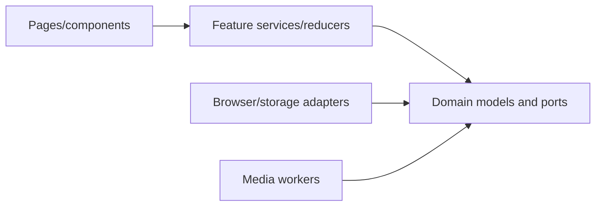

# FairScreen Codex Handoff

**Version:** 1.0  
**Date:** 2026-07-28  
**Status:** Ready for staged implementation  
**Recommended repository name:** `fairscreen`

## 1. What Codex is building

FairScreen is a static, local-first interview-practice and fairness-education application. Users can practice with any combination of camera, microphone, browser speech recognition, manual transcript, or neither device. It gives deterministic, evidence-linked feedback about answer content and separately describes optional audio/video capture conditions. Its Fairness Lab demonstrates that equivalent answer content can coexist with different video-condition observations.

FairScreen is not a hiring, ranking, proctoring, identity, emotion, personality, demographic, disability, medical, honesty, intent, confidence, employability, or competence inference system. It never produces an overall score and never lets video conditions affect answer-content analysis.

## 2. Source-of-truth documents

Place this specification package in `docs/spec/` before implementation:

1. `FairScreen_Master_Specification.md`
2. `01_FairScreen_Executive_Brief.md`
3. `02_FairScreen_PRD.md`
4. `03_FairScreen_UX_Specification.md`
5. `04_FairScreen_Technical_Architecture.md`
6. `05_FairScreen_Domain_Models.md`
7. `06_FairScreen_Measurement_Specification.md`
8. `07_FairScreen_Privacy_and_Responsible_AI.md`
9. `08_FairScreen_Implementation_Roadmap.md`
10. `09_FairScreen_Testing_and_QA.md`
11. `11_FairScreen_Decision_Log.md`

If two documents appear inconsistent, stop and resolve the conflict in the specification and Decision Log before implementing. The privacy/prohibited-feature rules are release blockers and take precedence over convenience.

## 3. Approved MVP stack

| Concern | Selection |
|---|---|
| Package/runtime | Current supported Node.js LTS and npm, version pinned in repository |
| UI | React + TypeScript |
| Build | Vite |
| Routing | React Router with `HashRouter` |
| Runtime boundary validation | Zod at persistence, export/import, worker-message, and external configuration boundaries |
| State | React Context + feature reducers; pure interview state machine |
| Styling | Tailwind CSS backed by custom-property tokens; system fonts |
| Icons | Lucide React, bundled with the application; icons never carry meaning alone |
| Unit/component tests | Vitest + Testing Library + `jest-dom` |
| Browser tests | Playwright |
| Accessibility automation | `axe-core`/Playwright accessibility checks |
| Persistence | Native IndexedDB behind typed repositories; in-memory fallback |
| Video | Same-origin packaged MediaPipe Tasks Vision Face Landmarker in a dedicated Web Worker |
| Audio | Web Audio API, optional MediaRecorder |
| Transcription | Typed provider; browser recognition only after disclosure; manual default/fallback |
| Charts | Prefer semantic tables and CSS; no chart dependency unless separately justified |
| Deployment | Host-neutral static build; deployment is a later human-reviewed action |

Do not add a backend, remote AI provider, authentication, analytics, tracking, remote logging, CDN asset, PWA/service worker, or an additional UI component framework in the MVP.

## 4. Target architecture

```text
src/
  app/                 # router, providers, app shell, error boundaries
  domain/              # stable models, enums, invariants, ports
  features/
    analysis/
    audio/
    device-check/
    education/
    export/
    fairness/
    interview/
    notes/
    questions/
    recording/
    reports/
    sessions/
    settings/
    setup/
    transcription/
    video/
  infrastructure/
    browser/           # browser APIs behind ports
    mediapipe/         # loader/assets adapter
    storage/           # IndexedDB and ephemeral repositories
  pages/
  shared/
    components/
    media/
    test/
    utils/
  styles/
public/
  mediapipe/           # pinned WASM/model assets and notices
tests/
  browser/
  fixtures/
  integration/
  privacy/
docs/
  spec/
```

Dependency direction:



Pages never call browser APIs or IndexedDB directly. Domain code imports neither React nor infrastructure. Content analysis has no dependency on video types. Browser, clock, IDs, randomness, storage, question, transcription, and analysis implementations are injected through typed ports.

## 5. Coding conventions

- Strict TypeScript; no explicit/implicit `any`; narrow `unknown` at boundaries.
- Prefer discriminated unions for state, availability, errors, and provider results.
- Domain dates are ISO strings; active timing uses monotonic timestamps.
- Every persisted/exported/worker payload carries a schema or protocol version and is runtime-validated.
- Pure calculations contain no clock, random, storage, DOM, network, or React dependency.
- User content never enters logs, thrown error strings, telemetry, snapshots intended for diagnostics, or test output.
- Production diagnostic events use stable codes and technical state only.
- Use semantic HTML before ARIA. All interactions work with a keyboard.
- Do not use color, motion, canvas, audio, or camera as the only carrier of information.
- Keep exact approved disclaimer/invariance copy in named constants with tests.
- No route or component may infer API support from browser name.
- Every acquired track, node, context, recorder, recognition session, worker, timer, and object URL registers cleanup.
- A failed write never produces a success message.
- Do not modify a protected formula, threshold, schema, privacy boundary, prohibited-feature rule, or copy constant without updating the Decision Log and relevant specifications.

## 6. Global definition of done

A task is done only when:

- its scope and exclusions were respected;
- applicable acceptance criteria in the PRD and Roadmap pass;
- formatting, lint, strict type-check, relevant tests, and production build pass;
- new behavior has unit/component/integration/browser tests at the appropriate layer;
- camera/microphone/manual/unsupported/error alternatives remain functional;
- acquired resources clean up under success, navigation, teardown, and error;
- no user-data network request or prohibited persistence was introduced;
- accessibility names, focus, keyboard, live status, contrast, motion, and reflow were checked;
- exact critical copy and schema/algorithm versions are tested;
- documentation and requirement traceability were updated;
- no unrelated feature or dependency was added;
- the result is summarized with files changed, commands run, test results, remaining manual checks, and any unresolved risk.

## 7. Ordered backlog

| Order | Task | Outcome |
|---:|---|---|
| 1 | M01 Foundation | Buildable strict app shell, design system, quality gates |
| 2 | M02 Routes | Navigable static education experience |
| 3 | M03 Data | Typed models, validation, IndexedDB, recovery |
| 4 | M04 Setup | Forms, capabilities, permissions, device check |
| 5 | M05 Questions | Deterministic 60+ template provider/editor |
| 6 | M06 Interview | Pure state machine and accessible timing |
| 7 | M07 Audio | Approved audio metrics and double-choice recording |
| 8 | M08 Video | Local worker-based MediaPipe condition pipeline |
| 9 | M09 Transcript | Disclosure, browser/manual/timing-only hierarchy |
| 10 | M10 Analysis | Deterministic reviewed-text feedback |
| 11 | M11 Reports | Reports, sessions, notes, deletion, exports |
| 12 | M12 Fairness | Trial comparison and seeded demo |
| 13 | M13 Accessibility | Full remediation and AT evidence |
| 14 | M14 QA | Cross-browser/failure/privacy regression matrix |
| 15 | M15 Hardening | Release candidate and deployment documentation |
| 16 | Final audit | Cross-spec reconciliation; no new feature work |

Use one prompt per task. Do not combine milestones into a single Codex request.

## 8. Copy-paste Codex prompts

### Prompt 1 — M01 only: initialize repository, architecture shell, and design system

```text
Create milestone M01 only for a new repository named `fairscreen`. Do not implement product pages, persistence, permissions, media capture, transcription, measurements, analysis, reports, or Fairness Lab.

Read `docs/spec/FairScreen_Master_Specification.md`, `02_FairScreen_PRD.md`, `03_FairScreen_UX_Specification.md`, `04_FairScreen_Technical_Architecture.md`, `05_FairScreen_Domain_Models.md`, `07_FairScreen_Privacy_and_Responsible_AI.md`, `08_FairScreen_Implementation_Roadmap.md`, `09_FairScreen_Testing_and_QA.md`, and `11_FairScreen_Decision_Log.md` before editing. If they conflict, stop and report the conflict.

Product boundaries:
- Static client-only app; no backend, account, analytics, tracking, remote logging, remote runtime assets, PWA, or secret.
- No identity, emotion, personality, demographic, disability, medical, honesty, intent, confidence, employability, competence, proctoring, or anti-cheating inference.
- No overall/combined score. Video observations can never affect content analysis.
- Device features are optional and no permission may be requested in this milestone.

Initialize current supported Node LTS + npm, React, strict TypeScript, Vite, Tailwind CSS, React Router using HashRouter, Lucide React, Zod, Vitest, Testing Library/jest-dom, Playwright, axe-core, ESLint, and Prettier. Pin the runtime/package-manager version.

Implement:
1. Feature-oriented directories from the architecture, with short README boundary notes where useful.
2. App entry, HashRouter-compatible shell, route placeholders only, global resource registry port, route-level error boundary, skip link, semantic header/nav/main/footer, and heading-focus utility.
3. Tailwind theme extensions backed by CSS custom-property tokens from the UX specification: color, type, spacing, radius, shadow, breakpoints, focus, default/high-contrast theme, forced-colors compatibility, reduced-motion behavior, system fonts, and print baseline.
4. Small accessible primitives needed by the shell: Button, LinkButton if needed, Notice, Status, VisuallyHidden, PageContainer, and ErrorBoundary fallback. Do not build a generic component library.
5. Strict compiler options including strict, noUncheckedIndexedAccess, exactOptionalPropertyTypes, and useUnknownInCatchVariables. Forbid explicit any.
6. Commands for format/check, lint, typecheck, unit/component test, browser smoke, build, prohibited-language scan, secret scan, and dependency/source audit.
7. CI that runs the quality checks. Privacy/policy checks must not use retry-to-pass behavior.
8. README with setup, scripts, architecture boundaries, specification version, and explicit M01 scope.

Add tests for shell landmarks, skip-link behavior, route-heading focus, keyboard focus visibility contract, reduced-motion/high-contrast tokens, 320 px shell reflow, error-boundary resource cleanup, static build under a non-root base path, and a prohibited-language scanner failing fixture with reviewed documentation-only allowlisting.

Acceptance:
- Clean install, lint, strict typecheck, tests, browser smoke, and production build pass.
- Production source has no any and no third-party runtime request, analytics/tracking dependency, remote font/icon/model, or secret-shaped client configuration.
- The UI shell is keyboard-operable at 320 CSS px and 200% zoom.
- Only M01 exists; later features remain placeholders.

Finish with changed files, commands/results, exact tests added, remaining manual contrast/license checks, and confirmation that no later milestone was implemented.
```

### Prompt 2 — M02 routing and static education

```text
Implement milestone M02 only on top of a passing M01. Read the Master, PRD FR-001–002, UX page/copy/navigation sections, Privacy/Responsible AI, Roadmap M02, QA, and Decision Log. Do not implement functional setup, persistence, permissions, media, analysis, or reports.

Keep these boundaries: client-only; no device prompt; no tracking or remote asset; no prohibited trait/identity/competence inference; no overall score; video conditions never influence content.

Implement HashRouter routes and responsive navigation for Home, Setup, Device Check, Interview, Report, Saved Sessions, Fairness Lab, Settings, Privacy, Methodology, Accessibility, and Not Found. Non-education routes remain honest “not available yet” placeholders. Build Home, Privacy, Methodology, and Accessibility pages using the exact critical copy and disclaimer placement in the UX specification, including “Practice the interview. Question the scoring.” Add footer privacy summary, page titles, current-route state, meaningful breadcrumbs where specified, heading focus, back/forward behavior, persistent safe Exit pattern where a placeholder requires it, and reusable status/notice/disclosure/limitation/empty-state components.

Use semantic HTML, keyboard behavior, visible focus, sparse live status, reduced motion, high contrast, black-and-white print, 320 px reflow, and no color-only meaning. Hash fragments for in-page links must not conflict with routing.

Tests:
- Every route has unique title, h1, landmarks, navigation state, and useful unknown-route behavior.
- Exact critical copy and prohibited-copy rules.
- No media/capability/permission call on any route.
- Keyboard navigation and disclosure behavior.
- Heading focus on forward navigation and sensible back-button behavior.
- 320 px, 200% zoom, high contrast, reduced motion, and print smoke.
- Automated accessibility scan for page states.

Run all prior checks plus relevant browser tests. Update traceability. Report changed files, results, manual NVDA/VoiceOver checks still required, and confirm no M03+ behavior was added.
```

### Prompt 3 — M03 domain, validation, and local data

```text
Implement milestone M03 only after M01–M02 pass. Read the Domain Models in full, PRD FR-033–037/044–045/049–050, Technical Architecture persistence sections, Privacy lifecycle, Roadmap M03, QA storage tests, and Decision Log.

Boundaries: no backend/network sync; no raw frames, landmarks, matrices, blendshapes, PCM, or unconfirmed recordings in storage; no user content in logs/errors; local browser storage is best-effort, not encrypted/guaranteed. Do not implement user-facing saved-session/report features yet.

Implement:
- All canonical domain models, enums, discriminated unions, invariants, ports, error codes, and injected Clock/Id/Random providers.
- Zod validation only at persistence, export/import, worker-message, and external-config boundaries; no any.
- Native IndexedDB behind typed repository ports, with stores/indexes/cascades exactly as specified.
- Ordered, idempotent, transactional schema migrations and version identifiers.
- Matching in-memory ephemeral repositories.
- Settings defaults/snapshots; query/filter primitives; approximate Storage API adapter.
- Corrupt-record isolation; unsupported future-version read-only recovery/export state; blocked/unavailable/quota result types.
- Deterministic namespaced demo seeding and removal without touching user records.
- Scoped deletion plans for recording, response, fairness trial, comparison, session, demo data, and all app data. Reset settings is separate.

Tests must cover valid/invalid schema boundaries, all migrations from every supported version, idempotence, aborted transaction, quota, blocked/unavailable database, corrupt record, future version, exact cascades, no false success, settings snapshot immutability, search field restrictions, deterministic demo seed/load/remove, and serialization guards rejecting prohibited raw fields.

Do not create real media Blobs in application fixtures. Use synthetic minimal Blob objects only in repository-specific tests where required. Inspect no user text in diagnostic output.

Acceptance: feature/domain code does not import IndexedDB; page code does not call storage; all repositories share ports; a failed write preserves in-memory value and cannot be displayed as saved; no prohibited raw field is representable at persistence/export boundaries.

Run all checks, update docs/traceability, and report files/results/manual browser storage checks. Do not implement M04+.
```

### Prompt 4 — M04 setup, capability, permission, and device check

```text
Implement milestone M04 only after M01–M03 pass. Read PRD FR-003–012/021/036, UX setup/device flows and exact copy, Architecture browser-port sections, Domain Models, Privacy permission/lifecycle rules, Roadmap M04, and QA permission/failure matrix.

Non-negotiable: loading or rechecking capability must never prompt. Camera/microphone requests are separate or explicitly combined only after an explanatory user action. Denial, dismissal, unavailable hardware, or storage failure must preserve entered setup and allow camera-only, mic-only, or neither. No MediaPipe, recording, speech, interview capture, or analysis yet.

Implement:
- Complete setup form for job title, company, job description, optional résumé, category, difficulty, question count 1–10, prep/answer time, flexible/strict/untimed mode, live coaching, transcription attempt, recording choice, and custom-question drafts. Use specified defaults/ranges and accessible error summary.
- Typed capability report covering secure context, media devices, enumeration, Web Audio, MediaRecorder MIME candidates, Worker, WebAssembly, MediaPipe init state (not initialized), speech recognition, IndexedDB, storage estimate/persistence, and print/export with supported/limited/unsupported/blocked/unknown.
- Just-in-time camera/mic disclosures and requests, default-device use before labels, post-permission enumeration refresh, input selectors, camera preview, display-only mirror toggle, hide/show preview, microphone meter with text equivalent, and global Stop.
- Limited-mode summary and ephemeral option when storage cannot initialize.
- Resource lifecycle via registry: replace/stop old tracks and audio graph, teardown/navigation/page-hide/error cleanup.

Use ports/fakes; no browser-name sniffing. A permission promise may remain pending, so include timeout/pending UI without auto-retry. Never log device labels.

Tests: setup boundaries/preservation; every capability status; no prompt on load/recheck; grant/deny/dismiss/pending/no-device/overconstrained/busy/revoked/track-ended; pre/post permission labels; device switch cleanup; suspended AudioContext fallback; camera-only/mic-only/neither paths; accessible meter status; keyboard/reflow/live-status; global cleanup.

Run prior suites and browser permission tests where automation permits. Record Safari/real-device steps as manual. Report results and confirm M05+ excluded.
```

### Prompt 5 — M05 deterministic question provider

```text
Implement milestone M05 only after M01–M04 pass. Read PRD FR-013–016/046–047, the complete approved question catalogue and setup UX, Architecture provider rules, Domain Models, Roadmap M05, and QA question tests.

Keep all generation local and deterministic. Do not add an LLM, network/API provider, secret, or claim semantic understanding. Never log job, résumé, or company text.

Implement a typed QuestionProvider port, LocalQuestionProvider, and fake provider. Include at least 60 reviewed unique templates: at least 12 each in general behavioral, software/technical, customer service, leadership, and investigative banks, with specified metadata. Implement normalized duplicate detection, deterministic non-sensitive role-term extraction with source/weight/cap/stop words, seeded selection using category/difficulty/rendered role terms, stable fallback on bank exhaustion, and custom add/edit/remove/reorder/mix with at least one valid question. Snapshot the final rendered question set so later setup edits cannot change it.

Use injected seed/random provider. Document normalization, extraction limitations, fallback ordering, and algorithm version.

Tests:
- Catalogue count, per-bank count, schema, IDs, normalized duplicate prompts.
- Blank/noisy/Unicode job text, stop words, caps, source/weight, determinism.
- Same input+seed deep-equal; duplicate prevention; exhaustion fallback.
- Custom empty/duplicate validation and reorder/snapshot behavior.
- Provider replacement without page changes.
- No network/logging of sensitive inputs.

Run all prior checks, update traceability, and provide an editorial-review checklist. Do not implement interview execution or later milestones.
```

### Prompt 6 — M06 interview state machine

```text
Implement milestone M06 only after M01–M05 pass. Read PRD FR-017–021/031/035, UX interview state/controls/timer copy, Domain Models, Architecture state strategy, Accessibility timing rules, Roadmap M06, and QA state/E2E tests.

Build a complete device-free/manual interview orchestration shell using a pure reducer/state machine with exactly: ready, preparing, answering, reviewing, betweenQuestions, complete. Implement only approved transitions and invalid-event privacy-safe diagnostic codes. Use injected monotonic clock and derive time from timestamps rather than tick counts.

Implement flexible mode (never hard stop), explicit strict-practice mode (warnings plus one-action extension), and untimed mode. Announce only state start, 30 seconds, 10 seconds, and expiry/overtime where applicable; announcements can be silenced. Provide state-appropriate Start, Finish, Repeat, Skip, End, Extend time, hide-preview placeholder, and global Stop controls. Prevent double activation. Preserve/discard work only after the specified confirmation.

Implement retries as separately timestamped attempts and let the user designate one for report display; never select or call one “best.” Persist safe progress through M03 ports. Reload/resume must enter a non-capturing Ready/between state and must not restart a timer/device.

No real audio, video, recorder, speech, content analyzer, or finished report in this task. Manual response text may be a simple placeholder needed to prove the state flow.

Tests: full state/event transition table; invalid events; fake-clock modes/warnings/extension/overtime/tab throttling; sparse/no announcements; double clicks; repeat/skip/end/exit; retry identity and user selection; safe reload/resume; cleanup event emission; keyboard-only 320 px complete journey; accessibility scans.

Run all checks and report results/manual screen-reader timing checks. Do not implement M07+.
```

### Prompt 7 — M07 audio measurements and recording

```text
Implement milestone M07 only after M01–M06 pass. Read PRD FR-008–009/019/021–022/033/048–049, exact formulas and thresholds in the Measurement Specification, Domain Models, Architecture audio/recording design, Privacy lifecycle, Roadmap M07, and QA audio/recorder fixtures.

Audio output may describe timing and level conditions only. Never call it confidence, enthusiasm, fluency, truthfulness, competence, accent quality, emotion, or personality. Raw PCM/time-domain arrays are transient and never enter React state snapshots, storage, logs, errors, or exports.

Implement behind typed ports:
- User-activated Web Audio graph, calibration, 20 Hz RMS sampling, dBFS floor, adaptive VAD/hysteresis, approved speech/silence/pause/level/clipping/coverage aggregates, sample count, availability, failure reasons, thresholds, algorithm/config version, and limitations exactly as specified.
- Microphone selection integration, suspended-context resume once, active indicator, partial/unavailable behavior, and cleanup.
- Optional MediaRecorder using ordered MIME feature detection plus runtime failure handling.
- Recording off by default. Enabling pre-answer capture is first choice; completed Blob remains in memory for review; only “Save recording on this device” may write it to IndexedDB. Discard/delete, object-URL cleanup, size/duration soft warning, and quota recovery are required.

Zero samples are Not available, not a zero metric. A recorder failure cannot lose transcript/timer/other metrics.

Tests: hand-calculated RMS/dBFS fixtures; below/at/above VAD thresholds; segments/pauses/clipping/coverage; silence/no samples/partial/interrupted; suspended context; MIME unsupported/rejected/error/zero-byte; no IndexedDB write before save; quota retains transient review; delete scope; all lifecycle exits; raw-array serialization guard; prohibited-language scan. Add browser manual matrix for real mics/formats.

Run all prior tests. Report results and real-device checks remaining. Do not implement transcription/video/content analysis.
```

### Prompt 8 — M08 local MediaPipe video conditions

```text
Implement milestone M08 only after M01–M07 pass. Read PRD FR-010/021/023–024, every video formula/threshold in the Measurement Specification, Domain Models, Architecture worker protocol, Privacy prohibited-feature/data-lifecycle sections, Roadmap M08, QA video/privacy tests, and Decision Log.

This feature observes capture conditions only. Do not implement emotion, identity, demographic, disability, medical, honesty, intent, confidence, personality, competence, liveness, proctoring, anti-cheating, or a good/bad eye-contact score. Video data must never enter content analysis.

Package a pinned, licensed MediaPipe Tasks Vision Face Landmarker, WASM, and model on the same origin. Load lazily only after explicit user enablement. Run detectForVideo in a dedicated Worker with typed versioned messages, monotonic timestamps, target 8 fps configurable 5–10, queue depth one, and stale-frame dropping. Use numFaces=2, disable blendshape output, and use transformation matrices only transiently where the specified orientation calculation requires them.

Implement exactly the approved aggregates: face presence, approximate centring, framing, near-camera orientation, brightness, multi-face, sample/drop counts, availability/partial/failure reasons, algorithm/config version, thresholds, and limitations. Frames, landmarks, matrices, and blendshapes are discarded immediately; the worker emits aggregates only. Display mirroring must not change analysis coordinates. Keep backlighting conclusion behind a default-off QA flag.

MediaPipe/model/worker failure must preserve the interview and optionally the preview, mark video metrics partial/unavailable, and never change content output. Worker restart is allowed once between questions, not as a hidden mid-answer reset.

Tests: all geometry/luminance boundaries; missing/one/multiple face; partial coverage; mirror independence; timestamp/queue/drop behavior; worker crash/backlog; model/init/inference failure; typed message rejection of raw fields; same-origin/lazy network audit; UI responsiveness; video-fixture mutation yields byte-identical content analyzer output; no prohibited wording. Document license and diverse-fixture manual gate.

Run all prior tests and report performance/network evidence and manual camera/diversity checks remaining. Do not implement M09+.
```

### Prompt 9 — M09 transcription and review gate

```text
Implement milestone M09 only after M01–M08 pass. Read PRD FR-025–026/046–047, UX transcription disclosure/review copy, Domain Models, Architecture provider/fallback design, Privacy browser-speech disclosure, Roadmap M09, and QA transcript/error tests.

Implement a typed TranscriptionProvider port with browser-recognition, manual, and timing-only providers. Manual is the reliable default/fallback. Browser recognition may start only after the exact disclosure that processing may be remote and controlled by the browser/vendor; do not claim local/offline processing unless reliably proven at runtime. Never infer support from browser name.

Implement capability states, explicit opt-in, language selection where specified, start/stop/abort, interim display, finalized-text merge, partial/error metadata, and preservation of finalized text on unsupported/denied/no-match/network/service/interruption cases. Manual type/paste/edit and timing-only completion must always remain available.

Keep final/interim recognition text in a separate transient review state and persist only the reviewed revision plus privacy-safe technical provider/error metadata. Content-analysis action remains disabled until the user checks “I reviewed this transcript,” uses an explicitly reviewed manual revision, or chooses timing-only. Exiting aborts recognition but does not erase reviewed text.

Do not add cloud APIs, keys, hidden uploads, or content analysis.

Tests: recognition event reducer ordering/duplication; interim/final merge; all support/error states; disclosure before start; no universal/local claim; partial preservation; edit/revision/history; review gate; manual/timing-only complete journeys; exit cleanup; accessibility/live status; no user text in diagnostics.

Run all checks, record observed browser/version behavior separately from product guarantees, and report results. Do not implement M10+.
```

### Prompt 10 — M10 deterministic content analysis

```text
Implement milestone M10 only after M01–M09 pass. Read PRD FR-024/027–029/046–047, every answer-analysis rule in the Measurement Specification, Domain Models, Architecture content boundary, Privacy/Responsible AI wording, Roadmap M10, QA golden/boundary tests, and Decision Log.

Implement a pure, deterministic, versioned AnswerAnalyzer behind its typed port. It accepts question, reviewed transcript, optional approved audio/timing prerequisites, language/config, and no VideoMetrics or video import. Analyze exactly: question relevance, specificity, example evidence, personal contribution, outcome, measurable evidence, possible STAR structure, repetition, filler language, length, approximate pace, and clarity/concision.

Use only ratings strong, developing, needsMoreEvidence, notAvailable, notApplicable. Every category has rule ID/version, prerequisites, cautious message, evidence spans where applicable, limitations, and suggestions. Never invent a fact or verify truth. Missing prerequisite yields notAvailable/notApplicable. Timing-only mode provides only justified timing information.

Do not implement an overall/combined score, rank, suitability, employability, confidence, emotion, personality, grammar/accent judgment, remote AI, or video-weighted analysis. Copy must say “appears to include,” “was not detected,” or “may be incomplete” as specified.

Tests:
- Immediately below/at/above every threshold and all documented fixtures.
- Empty/short/Unicode/unsupported-language/repeated/numeric/STAR/filler/pace cases.
- Evidence offsets map exactly to reviewed text.
- Same input/config/version deep-equal.
- Missing prerequisites.
- Analyzer compiles/tests without video types; architecture import test; mutating all video fixtures yields byte-identical output.
- Golden approved outputs and prohibited-language/overall-score mutation tests.

Run all prior checks, update algorithm documentation/traceability, and report editorial review remaining. Do not implement reports/Fairness Lab.
```

### Prompt 11 — M11 reports, sessions, notes, deletion, and export

```text
Implement milestone M11 only after M01–M10 pass. Read PRD FR-030–037/044/049–050, report/saved-session/settings UX and exact limitations, Domain Models, Architecture persistence/export, Privacy sensitivity/deletion rules, Roadmap M11, and QA report/export/storage tests.

Implement:
- Session report with overview, per-question attempts, user-selected display attempt, reviewed transcript, content categories/evidence/suggestions, audio conditions, then a distinctly separate video-conditions section, summary, strengths, notes, and limitations. Missing/partial values display availability/coverage, never zero.
- Retry history without algorithmic “best.”
- Saved-session search/sort/composable filters, distinct empty/no-result/error states, and safe non-capturing resume.
- Session/response notes, local only, never analyzed; export only when selected.
- Settings controls/defaults/ranges, reset-settings separate from delete-all.
- Scoped deletion and approximate storage usage/soft recording warning.
- Local print, plain-text export, and versioned JSON export. Show an accurate sensitivity preview; sanitize filename; recordings are never embedded; JSON validates. Include required fairness warning and algorithm/schema versions.

Do not add cloud sharing, accounts, sync, import of arbitrary untrusted archives, or a combined score/chart. Content appears before visual conditions and types/serializers remain separate.

Tests: report missing/partial/attempt cases; filters/search excludes recording binary; safe resume; notes isolation/export choice; every deletion cascade/failure; settings snapshot; storage estimate absent/quota; sensitivity preview equals output; filename safety; JSON schema/golden text; recording absence; print black-and-white/unclipped; keyboard tables/320 px; export error recovery and URL cleanup.

Run all prior checks and inspect print output in supported browsers. Report results/manual print validation. Do not implement Fairness Lab.
```

### Prompt 12 — M12 Fairness Lab

```text
Implement milestone M12 only after M01–M11 pass. Read PRD FR-038–045, Fairness Lab UX/exact invariance copy, all similarity formulas and seeded data in the Measurement Specification, Domain Models, Privacy/Responsible AI limitations, Roadmap M12, and QA fairness tests.

Build a descriptive comparison, not a bias certification or competence evaluation.

Implement Fairness Trial groups for the same question. Required user-described condition labels: near camera, looking at question, side camera, camera below monitor, dim, backlit, partial framing, natural glances, low resolution, and custom. Do not claim labels are verified ground truth.

Implement deterministic transcript normalization/tokenization, token-frequency unigram cosine, ordered-word-trigram Jaccard, S = 0.60*cosine + 0.40*Jaccard, word-count difference, exact/substantially unchanged/similar/different bands and guards, pairwise results, missing state, and all-pair group conclusion exactly as specified. Show components and transcript difference, not only a band.

Render Answer Content first and Video Conditions as independent typed datasets and canonical accessible tables. Never join a content rating to a video metric or make a combined visualization/score. When every pair qualifies, display exactly: “The answer content remained unchanged. Differences in video conditions should not be interpreted as differences in competence.”

Add the deterministic, clearly synthetic, camera-free four-condition seeded demo using the exact transcript/metrics. It loads without permission, is idempotent, does not overwrite user data, and removes independently. Add comparison notes and print/text/versioned JSON exports containing the exact statement when applicable and limitations that a small descriptive comparison cannot establish causality or system bias.

Tests: hand-calculated cosine/Jaccard; Unicode/empty cases; every score/word-count boundary; all-pair/missing logic; exact statement; seeded golden data; condition editor; independent table/type/export boundaries; no camera prompt; idempotent load/remove; export schema/limitations; accessibility/reflow/print; prohibited combined view.

Run all prior checks and report responsible-AI/accessibility manual review remaining. Do not start final accessibility/QA hardening.
```

### Prompt 13 — M13 accessibility completion

```text
Implement milestone M13 only after M01–M12 pass. Read all ACC-001–020 requirements, the entire UX accessibility section, Roadmap M13, QA accessibility protocol, and WCAG-linked rationale in the specification.

Do not add product features. Audit and remediate every principal route and major state for WCAG 2.2 AA target behavior: semantics, labels/descriptions, required/optional/errors, error-summary links, page/dialog/state focus, focus return, no traps, visible/unobscured focus, keyboard operations, sparse live announcements, target size, contrast, forced colors, reduced motion, 200% zoom, 320 px reflow, text spacing, table/chart alternatives, color independence, timing adjustment, and independent hiding of coaching/preview/meters/announcements.

Verify camera-disabled, microphone-disabled, manual transcript, timing-only, and seeded Fairness demo as complete supported workflows. Ensure one primary action per interview state, persistent Exit/Stop, no sudden sound, no punitive scoring/color, and no movement/silence/detection language that implies misconduct or personal failure.

Expand automated axe and browser accessibility coverage for every page and key empty/loading/ready/active/partial/error/complete/dialog state. Add keyboard, reflow, text-spacing, forced-colors, reduced-motion, and announcement-deduplication tests. Create `docs/accessibility-conformance.md` with test date/version fields and manual scripts for NVDA+Chrome, NVDA+Firefox, VoiceOver+Safari, keyboard-only, zoom, forced colors, and reduced motion.

Run what can be automated. Do not fabricate manual assistive-technology results; leave explicit record fields for a human run. Any exception needs severity, impact, workaround, owner, and date and cannot silently pass.

Run regression suites after remediation. Report fixed issues, automated evidence, and exact manual AT checks still open. Do not implement unrelated M14/M15 work.
```

### Prompt 14 — M14 integrated QA and privacy regression

```text
Implement milestone M14 only after M01–M13 pass. Read the full Testing and QA Specification, all PRD requirement/acceptance criteria, Privacy/Responsible AI, Roadmap M14, and Decision Log. This task adds/fixes test coverage and defects found by it; it adds no new product feature.

Build complete traceability from FR-001–050, NFR-001–014, PRIV-001–017, ACC-001–020, and ERR-001–014 to automated or named manual evidence. Organize unit, component, integration, browser, privacy, fixture, and manual matrices as specified.

Implement failure fixtures for permission denied/dismissed/pending, missing/busy/ended device, suspended audio, recorder unsupported/error/zero byte, MediaPipe init/inference failure, worker crash/backlog, speech failures, IndexedDB unavailable/blocked/quota, corrupt/future records, delete/export/provider/render error. Assert useful fallback, resource cleanup, partial/unavailable state, and no false success.

Implement privacy/policy audits:
- Intercept network through full media/manual/report/Fairness flows; only same-origin static assets, with browser speech separately disclosed.
- Inspect state, worker-to-main results, IndexedDB, logs/errors, and text/JSON exports for absence of frames, landmarks, matrices, blendshapes, PCM, unconfirmed recordings, and user-content diagnostics; separately confirm main-to-worker transferable frames are closed and never retained.
- Ensure MediaPipe assets are lazy and same-origin.
- Add mutation tests for VideoMetrics entering content analysis, overall score, prohibited inference, raw landmark persistence, joined content/video visualization, unreviewed transcript analysis, auto-save recording, removed limitations, suspicious/cheating copy, and premature backlight flag.

Execute current/previous desktop Chrome, Edge, Firefox, Safari where available and responsive iOS Safari/Android Chrome limited-mode smoke. Record exact versions/dates and distinguish defect, limitation, permission policy, and untested. Do not claim results for unavailable environments; create a manual run sheet.

Do not retry privacy/policy failures into passing. Quarantine any other flaky test only with owner, issue, and expiry.

Run full clean suite and report coverage gaps, failures fixed, exact browser/manual work remaining, and release blockers. Do not deploy.
```

### Prompt 15 — M15 production hardening and release candidate

```text
Implement milestone M15 only after M01–M14 pass and manual blockers are visible. Read NFR-001–014, PRIV-001–017, Roadmap M15, QA release checklist, Architecture deployment/security sections, and Decision Log. Do not purchase/configure a paid service or deploy without human approval.

Create a host-neutral production release candidate:
- Pin Node/npm/dependencies/model assets; clean reproducible install/build.
- Verify code splitting and that camera-free shell does not load MediaPipe.
- Enforce/measure UI responsiveness, worker 8 fps target (5–10 configurable), queue depth one, stale drop, lifecycle leak checks, long-session/storage stress.
- Create deployment documentation and static-host examples for HTTPS, restrictive CSP, Permissions-Policy, Referrer-Policy, correct WASM/model MIME and cache behavior, and non-root/hash routing. Validate headers in report-only/test mode so camera/mic/WASM are not accidentally broken.
- Generate asset/dependency/license/SBOM inventory, third-party notices, vulnerability review, algorithm/config/schema versions, release notes, support limitations, data export/delete guidance, and privacy-safe diagnostics guide.
- Audit bundle/source/network: no secret, analytics, tracking, remote logging, remote font/icon/model/script, user-data source map, or unapproved feature.
- Reconcile docs and Decision Log; create a release checklist with dated product, privacy/responsible-AI, accessibility, and release-owner sign-off fields.

Core flow must work offline after same-origin assets load, except separately opted browser speech outside FairScreen control. Release notes must list exact tested browser versions and observed limitations. Deployment target/cost/region/headers remain a human decision.

Run clean install, all tests, production build, bundle/network inspection, non-root static hosting, offline-after-load core flow, CSP validation, migration/recovery, performance, and leak tests. Report artifact sizes/results, remaining human sign-offs, and explicit go/no-go blockers. Do not deploy.
```

### Prompt 16 — final integration and specification audit

```text
Perform a final integration audit only after M01–M15 are complete. Do not add new features, refactor for taste, deploy, or weaken a requirement to make a test pass.

Read every file in `docs/spec/`. Compare implemented routes, models, defaults, copy, state transitions, formulas, thresholds, schema/config/algorithm versions, storage lifecycle, error recovery, exports, accessibility behavior, test evidence, and Decision Log against the source specifications.

Verify with concrete evidence:
1. All FR-001–050, NFR-001–014, PRIV-001–017, ACC-001–020, and ERR-001–014 have traceable passing evidence or a clearly named manual release blocker.
2. No backend, account, analytics, tracking, remote logging/runtime asset, secret, remote AI, or hidden upload exists.
3. No identity/emotion/personality/demographic/disability/medical/honesty/intent/confidence/employability/competence/proctoring/anti-cheating inference or overall score exists.
4. Content analysis has no video dependency at type, import, runtime, persistence, UI, or export boundaries.
5. Raw frames/landmarks/matrices/blendshapes/PCM and unconfirmed recordings never persist; resources always stop.
6. Device access and browser speech are just-in-time, disclosed, optional, and have complete fallbacks.
7. Measurement and similarity golden fixtures exactly match the specification.
8. Camera-free, microphone-free, manual, timing-only, ephemeral, and seeded-demo journeys pass.
9. Report and Fairness datasets/exports remain separate, accessible, schema-valid, recording-free, and include exact limitations/statements.
10. Supported browser/accessibility claims match dated human evidence and do not invent unrun results.

Run a clean install and the complete static, unit, component, integration, browser, privacy, accessibility-automation, build, bundle, network, storage, export, performance, and leak suite. Inspect the production bundle and a fresh IndexedDB manually or via an independent audit script.

Fix only clear deviations already authorized by the specifications. If a specification conflict, protected-boundary change, new dependency, or product decision is required, stop and present it rather than guessing.

Return:
- concise release verdict: GO, NO-GO, or GO AFTER LISTED MANUAL GATES;
- requirement coverage counts and missing IDs;
- commands/results and exact browser/AT evidence;
- deviations fixed;
- unresolved blockers by severity;
- privacy/responsible-AI boundary confirmation;
- files/documents requiring human sign-off.
```

## 9. Human decisions Codex must not silently make

Stop and ask before:

- selecting or purchasing a production host or domain;
- changing privacy/data-retention boundaries;
- adding a backend, remote model/provider, authentication, analytics, telemetry, or error-reporting service;
- enabling a disabled/gated condition claim such as backlighting without required QA;
- changing a measurement formula, threshold, similarity band, prohibited-feature rule, or exact approved warning;
- collecting/retaining real QA participant media or biometric-derived data;
- adding a new runtime dependency not covered by the stack/Decision Log;
- waiving a serious accessibility, privacy, data-loss, or ethical-boundary issue;
- claiming legal/regulatory compliance or bias certification.

## 10. Handoff checklist

- [ ] Specification package copied unchanged to `docs/spec/`.
- [ ] Repository created as `fairscreen`.
- [ ] Prompt 1 run by itself and reviewed before Prompt 2.
- [ ] Each later prompt run in order with its own reviewable change set.
- [ ] Requirement traceability updated every milestone.
- [ ] Manual evidence never fabricated.
- [ ] Protected-boundary changes have Decision Log entries and version increments.
- [ ] Final audit prompt run after M15.
- [ ] Deployment remains a human-reviewed action.
